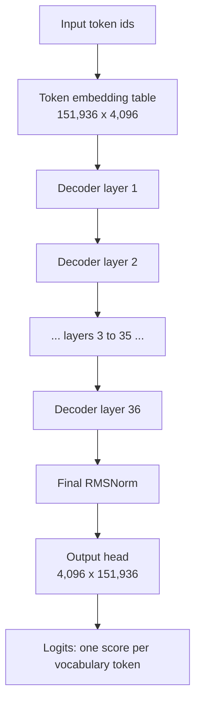
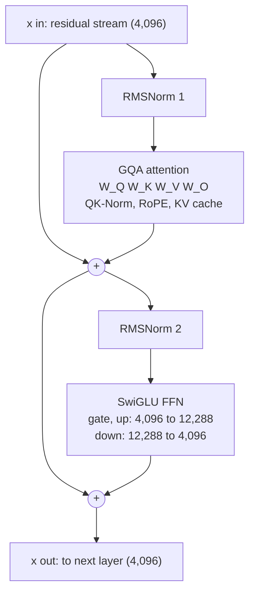

# Transformer Architecture for Inference

## What you will learn

This document walks through the decoder-only transformer as it actually executes during inference, using Qwen3-8B (36 layers, 8.2B parameters) as the running example on our research machine. You will learn what each building block computes: token embeddings, the residual stream, grouped-query self-attention, the SwiGLU feed-forward network, RMSNorm, and the output head. You will see a full parameter accounting that derives, matrix by matrix, where all 8,190,735,360 parameters live. By the end you should be able to trace one token through one decoder layer by hand and predict, from memory bandwidth alone, roughly how fast this machine can generate tokens.

## The shape of the model: a stack of 36 identical layers

A modern LLM is architecturally boring, and that is a gift for optimization work. Qwen3-8B is:

1. One embedding table that turns token ids into vectors.
2. A stack of 36 identical decoder layers, each containing a self-attention block and a feed-forward block.
3. One final RMSNorm and one output projection (the "head") that turns the last vector back into a probability distribution over the vocabulary.

Every layer has exactly the same shapes and the same code path. When llama.cpp runs the model, it executes the same small set of kernels 36 times with different weight tensors. Understand one layer and you understand 85 percent of the parameters and nearly all of the runtime.



The key dimensions of Qwen3-8B, which we will use in every calculation below:

```
Hyperparameter              Value
-----------------------------------
Hidden size (d_model)       4,096
Decoder layers              36
Query heads                 32
KV heads (GQA)              8
Head dimension              128
FFN intermediate size       12,288
Vocabulary size             151,936
Max context (native)        32,768
Embedding/head tying        No (separate matrices)
```

## Token embeddings: from ids to vectors

The tokenizer (byte-pair encoding) converts text into integer ids in the range 0 to 151,935. The embedding table is a matrix of shape 151,936 x 4,096. "Embedding lookup" is literally reading row number `token_id` out of that matrix. There is no matrix multiplication here, just a memory copy of one 4,096-element row per token.

This asymmetry matters for inference cost. The embedding table holds 622 million parameters, but per generated token you touch only one row of it: 4,096 values, about 8 KB at FP16 and only a few KB quantized. Compare that with the output head at the other end of the model, which is the same size but must be read in full for every token. Same parameter count, wildly different bandwidth cost.

## The residual stream

After embedding, the token is a 4,096-dimensional vector. That vector, called the residual stream, is the model's shared workspace. Every layer follows the same pattern:

- Read the stream, normalize a copy of it.
- Compute something (attention or FFN).
- Add the result back into the stream.

Nothing ever overwrites the stream. Layers communicate only by adding vectors into this one 4,096-dimensional channel, and later layers read the accumulated sum of everything earlier layers wrote. This "pre-norm" residual design is why 36-layer models train and run stably: the identity path from embedding to output head is unbroken, and each layer contributes a bounded update on top of it.

For inference this has a practical consequence: the activation working set is tiny. During single-token decode the stream is one vector of 4,096 floats, 16 KB at FP32. Activations are effectively free. The entire cost of decode is streaming the weights past that tiny vector, which is why memory bandwidth, not compute, is the wall we care about in this project.

## RMSNorm: cheap stabilization

Before each attention block and each FFN block, the stream is normalized with RMSNorm:

```
rms(x) = sqrt( mean(x_i^2) + eps )
y_i    = (x_i / rms(x)) * g_i
```

That is it: divide the vector by its root-mean-square magnitude, then scale elementwise by a learned gain vector `g` of length 4,096. Unlike classic LayerNorm there is no mean subtraction and no bias, which removes a reduction pass and a parameter vector. Each RMSNorm holds just 4,096 parameters, and with two per layer plus one final norm the entire model contains 36 x 8,192 + 4,096 = 299,008 norm parameters, a rounding error. Its runtime cost is equally negligible; it exists to keep the numbers flowing through 36 layers well conditioned.

Qwen3 adds one twist: QK-Norm. After projecting queries and keys, each 128-dimensional head vector is itself RMSNorm-ed (one shared 128-element gain for queries, one for keys, per layer). This replaced the QKV bias terms Qwen2 used and stabilizes attention logits. It costs 256 parameters per layer and is worth knowing about because you will see `attn_q_norm` and `attn_k_norm` tensors when you inspect the GGUF file.

## Self-attention: from MHA to GQA

Attention is how a token reads information from earlier positions. Start with classic multi-head attention (MHA), then apply the modification modern models actually ship.

The normalized stream vector x (4,096) is multiplied by three weight matrices:

- Queries: q = x W_Q, reshaped into 32 heads of 128 dims each (32 x 128 = 4,096).
- Keys: k = x W_K.
- Values: v = x W_V.

In MHA there would be 32 key heads and 32 value heads to match the 32 query heads. Each head computes, against every cached position t in the context:

```
score_t = (q . k_t) / sqrt(128)
weights = softmax(scores)          (causal: only positions <= current)
out     = sum_t weights_t * v_t
```

The 32 head outputs (128 dims each) are concatenated back to 4,096 and multiplied by an output matrix W_O, and that result is added to the residual stream. Before scoring, a rotary position embedding (RoPE) is applied to q and k: each pair of dimensions is rotated by an angle proportional to the token's position, which is how the model knows token order without any position parameters. Qwen3 uses a RoPE base of 1,000,000 to support long contexts.

The problem with MHA at inference time is the KV cache. Generation is autoregressive, so keys and values for every past token must be stored and re-read for every new token. With 32 KV heads that cache is enormous. Grouped-query attention (GQA) is the fix: keep all 32 query heads, but share keys and values across groups. Qwen3-8B uses 8 KV heads, so each group of 4 query heads reads the same K and V. Quality stays close to MHA (the GQA paper shows uptrained grouped models nearly match full MHA), while KV cache and W_K/W_V sizes shrink 4x.

Concrete KV cache math for this machine, at FP16 (2 bytes per value):

```
Per token, per layer: 2 (K and V) x 8 heads x 128 dims x 2 B = 4 KB
Per token, all 36 layers:                                     144 KB

Context length    GQA, 8 KV heads     Hypothetical MHA, 32 heads
--------------------------------------------------------------
4,096 tokens      576 MB              2.25 GB
8,192 tokens      1.13 GB             4.5 GB
32,768 tokens     4.5 GB              18 GB
```

On our 8 GB RTX 5060, GQA is the difference between an 8K context fitting next to the 5 GB model (6.1 GB total) and an MHA-sized cache pushing the total to 9.5 GB, well past what the card holds.

## The feed-forward network: SwiGLU

The second block in each layer is a position-wise feed-forward network. Each token's vector is processed independently, no interaction between positions. Modern models use the SwiGLU variant instead of the original two-matrix ReLU FFN:

```
gate = x W_gate        (4,096 -> 12,288)
up   = x W_up          (4,096 -> 12,288)
h    = SiLU(gate) * up (elementwise;  SiLU(z) = z * sigmoid(z))
out  = h W_down        (12,288 -> 4,096)
```

The gating structure (one path is squashed through SiLU and multiplies the other) consistently outperforms plain ReLU FFNs at equal parameter count, which is why nearly every major open model since LLaMA uses it or a close GLU cousin (Gemma, for example, gates with GELU instead of SiLU). Because SwiGLU needs three matrices instead of two, the intermediate size is set to 3x the hidden size (12,288 = 3 x 4,096) rather than the classic 4x, keeping the parameter budget comparable.

Note the proportions: the three FFN matrices hold 151 million parameters per layer versus attention's 42 million. The FFN is 78 percent of each layer. When we later ask "which tensors should live in scarce VRAM," the answer is dominated by FFN weights.

## The output head

After layer 36, the stream passes through a final RMSNorm and then the head: a 4,096 x 151,936 matrix multiply producing one logit per vocabulary token. Softmax turns logits into probabilities, and the sampler (greedy, top-k, top-p, temperature) picks the next token id, which loops back to the embedding table and the whole stack runs again.

Two inference-relevant facts. First, during decode only the last position needs logits, so this is one vector-matrix multiply per token, but it reads the entire 622M-parameter matrix every time, making the head one of the single most bandwidth-hungry tensors in the model. Second, Qwen3-8B does not tie the head to the embedding table (smaller Qwen3 models do), so both 622M matrices exist separately in the file, and together they account for the 1.24B gap between the 8.19B total and the 6.95B non-embedding count Qwen reports.

## Parameter counting: where the 8.2B parameters live

Now derive the full count from the dimensions. Every number below is exact.

```
Component                  Shape                    Parameters       Share
--------------------------------------------------------------------------
Token embedding            151,936 x 4,096          622,329,856       7.6%

Per decoder layer:
  W_Q                      4,096 x 4,096             16,777,216
  W_K                      4,096 x 1,024              4,194,304
  W_V                      4,096 x 1,024              4,194,304
  W_O                      4,096 x 4,096             16,777,216
  QK-Norm gains            2 x 128                          256
  Attention subtotal                                 41,943,296      21.7% of layer
  W_gate                   4,096 x 12,288            50,331,648
  W_up                     4,096 x 12,288            50,331,648
  W_down                   12,288 x 4,096            50,331,648
  FFN subtotal                                      150,994,944      78.3% of layer
  2 RMSNorm gains          2 x 4,096                      8,192
  Layer total                                       192,946,432

All 36 layers              36 x 192,946,432       6,946,071,552      84.8%
Final RMSNorm              4,096                          4,096
Output head (untied)       4,096 x 151,936          622,329,856       7.6%
--------------------------------------------------------------------------
Total                                             8,190,735,360     100.0%
```

Sanity checks: the K and V projections are 4,096 x 1,024 because 8 KV heads x 128 dims = 1,024, one quarter of the query width, exactly the GQA saving. The 36-layer subtotal of 6.946B matches Qwen's published "6.95B non-embedding" figure, and the grand total of 8.19B matches the advertised 8.2B. The lesson of the table: 84.8 percent of the model is the repeated layer stack, and inside each layer the FFN dominates 78 to 22 over attention.

At Q4_K_M quantization (roughly 4.9 bits per weight on average, since some tensors stay at higher precision), the file size is about 8.19B x 4.9 / 8 = 5.0 GB, which matches the real Qwen3-8B Q4_K_M GGUF at about 5.03 GB. Per decoder layer that is roughly 118 MB of weights.

## One decoder layer during inference, step by step

Here is exactly what layer i computes when generating token number t during decode. Input: the residual stream vector x, 4,096 floats.

1. **Attention pre-norm.** Compute x_n = RMSNorm(x) using this layer's first gain vector. x itself is kept untouched for the residual add.
2. **QKV projection.** q = x_n W_Q (4,096 values, viewed as 32 heads x 128), k = x_n W_K and v = x_n W_V (1,024 values each, 8 heads x 128).
3. **QK-Norm and RoPE.** RMSNorm each q head and k head with the shared 128-dim gains, then rotate q and k by the position-t RoPE angles.
4. **KV cache append.** Write this token's k and v (4 KB total for this layer at FP16) into the cache at position t.
5. **Scores.** For each of the 32 query heads, dot the query against all t+1 cached keys (positions 0 through t) of its assigned KV head (4 query heads share each KV head), scale by 1/sqrt(128). This reads the entire K half of the layer's cache.
6. **Softmax and mix.** Softmax the t+1 scores per head, then take the weighted sum of the t+1 cached value vectors. This reads the V half of the cache. Result: 32 heads x 128 = 4,096 values.
7. **Output projection and residual add.** Multiply by W_O and add into the stream: x = x + attn_out.
8. **FFN pre-norm.** x_n = RMSNorm(x) with the second gain vector.
9. **SwiGLU.** h = SiLU(x_n W_gate) * (x_n W_up), giving 12,288 values, then ffn_out = h W_down.
10. **Second residual add.** x = x + ffn_out. This x flows to layer i+1.



Notice what steps 2, 7, and 9 have in common: they are all vector-matrix multiplies where a 4 KB to 48 KB activation is multiplied against tens of megabytes of weights. Each weight is read once and used for exactly two floating point operations (one multiply, one add). That ratio, about 2 FLOPs per parameter, is the arithmetic signature of decode and the reason it is memory bound on every device we own.

## What this costs on our machine

Total work per generated token is roughly 2 x 8.19B = 16.4 GFLOPs, trivial for either the i7-14650HX or the RTX 5060. The binding constraint is reading the 5.0 GB of quantized weights, once, every token, plus the KV cache.

```
Path                         Bandwidth        Ceiling = BW / 5.0 GB
----------------------------------------------------------------------
System RAM (DDR5-5600 x2)    89.6 GB/s peak   17.9 tok/s
  realistic (~65% eff.)      ~58 GB/s         ~11.6 tok/s
RTX 5060 Laptop GDDR7        448 GB/s         89.6 tok/s
SSD (if we ever stream)      ~5.5 GB/s        ~1.1 tok/s
```

The arithmetic: DDR5-5600 dual channel moves 5,600 MT/s x 8 B x 2 channels = 89.6 GB/s. Dividing by the 5.0 GB read per token gives a hard ceiling of 17.9 tokens/s for CPU-only decode, and real sustained bandwidth lands closer to 58 GB/s, so 11 to 12 tokens/s is the honest CPU expectation. One caveat specific to this machine: the mixed 16 GB + 32 GB modules mean only the first 32 GB interleaves across both channels; allocations landing in the last 16 GB run single channel at half bandwidth. The GPU's 448 GB/s would support about 90 tokens/s, and Qwen3-8B at Q4_K_M (5.0 GB) plus a 1.13 GB KV cache for 8K context fits inside 8 GB of VRAM with room for compute buffers. That is exactly why an 8B model is our comfortable baseline and anything bigger forces the offloading techniques this project exists to study.

## References

- Vaswani et al., "Attention Is All You Need", 2017. https://arxiv.org/abs/1706.03762
- Ainslie et al., "GQA: Training Generalized Multi-Query Transformer Models from Multi-Head Checkpoints", 2023. https://arxiv.org/abs/2305.13245
- Shazeer, "Fast Transformer Decoding: One Write-Head is All You Need" (MQA), 2019. https://arxiv.org/abs/1911.02150
- Shazeer, "GLU Variants Improve Transformer", 2020. https://arxiv.org/abs/2002.05202
- Zhang and Sennrich, "Root Mean Square Layer Normalization", 2019. https://arxiv.org/abs/1910.07467
- Su et al., "RoFormer: Enhanced Transformer with Rotary Position Embedding", 2021. https://arxiv.org/abs/2104.09864
- Qwen Team, "Qwen3 Technical Report", 2025. https://arxiv.org/abs/2505.09388
- Touvron et al., "LLaMA: Open and Efficient Foundation Language Models", 2023. https://arxiv.org/abs/2302.13971
- Elhage et al., "A Mathematical Framework for Transformer Circuits", 2021. https://transformer-circuits.pub/2021/framework/index.html

## Why this matters for our research

Our goal is running models larger than 8 GB of VRAM on cheap hardware, and every lever we will pull is visible in this architecture. The model is 36 identical, independent layers connected only by a 16 KB residual vector, which is precisely what makes layer-wise CPU/GPU splitting (llama.cpp's `-ngl`) possible: any prefix of layers can live in VRAM and the rest in system RAM, with only a tiny vector crossing the PCIe bus per token. The parameter table tells us where offloading decisions bite: FFN matrices are 78 percent of each layer, so they are the first candidates for VRAM placement or aggressive quantization, while the 622M-parameter output head is read fully every token and punishes slow placement. GQA's 4x KV cache reduction is what lets long contexts coexist with weights in 8 GB at all, and the KV table above becomes our budget sheet when we trade context length against offloaded layers. Most importantly, the bandwidth arithmetic (17.9 tokens/s ceiling on our RAM, 89.6 on our VRAM) gives us a falsifiable performance model: for any hybrid split we try in later phases, we can predict tokens/s from bytes-per-token on each bus before we run a single benchmark, and every optimization we discover must beat that prediction or explain why it cannot.
