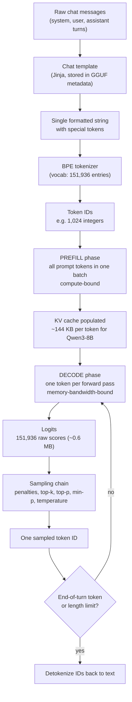
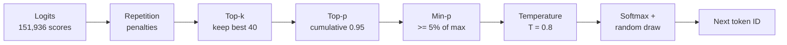

# The Inference Pipeline: Tokenization to Sampling

## What you will learn

This document walks the full journey of a prompt through llama.cpp: from raw text, through BPE tokenization and chat templating, into the two distinct execution phases (prefill and decode), and finally out through logits and the sampling chain that picks each generated token. You will learn why the same model on the same hardware processes your prompt at hundreds of tokens per second but generates output at only tens of tokens per second, and you will see the roofline arithmetic that explains it. All concrete numbers are computed for our research machine: an i7-14650HX with 48 GB DDR5-5600 (~89.6 GB/s) and an RTX 5060 Laptop GPU with 8 GB GDDR7 (~448 GB/s), running Qwen3-8B as a ~5 GB Q4_K_M GGUF. By the end you should be able to predict this machine's generation speed ceiling from first principles before ever running a benchmark.

## The pipeline at a glance

Every request to llama.cpp goes through the same stages. Text in, text out, with a loop in the middle that runs once per generated token.



Two things in this diagram deserve your attention before we zoom in. First, the model never sees text. It sees integers on the way in and produces a probability distribution over integers on the way out. Second, the loop from sampling back to decode is the autoregressive loop: each generated token is appended to the sequence and becomes input for the next step. Everything about generation speed follows from what one trip around that loop costs.

## Tokenization: text to integers

A neural network operates on vectors, so text must first become a sequence of integer IDs, each ID indexing a row in the model's embedding table. The dominant algorithm for building that mapping is Byte Pair Encoding (BPE), originally a compression technique, adapted for NLP by Sennrich et al. (2016).

BPE training works bottom-up:

1. Start with a base alphabet. Modern LLMs use byte-level BPE: the 256 possible byte values are the starting symbols, so any input, including emoji, code, and arbitrary Unicode, is representable with zero out-of-vocabulary failures.
2. Scan a large corpus and count adjacent symbol pairs.
3. Merge the most frequent pair into a new single symbol and add it to the vocabulary.
4. Repeat until the vocabulary reaches a target size.

The result is a vocabulary plus an ordered list of merge rules. At inference time the tokenizer replays those merges on your text, greedily, so frequent character sequences collapse into single tokens. Common English words become one token, rare words split into subword pieces, and truly novel strings fall back to raw bytes. A typical BPE segmentation looks like this:

```
"The tokenizer splits unbelievable words."
-> ["The", " token", "izer", " splits", " un", "believ", "able", " words", "."]
```

Note the leading spaces baked into tokens: byte-level BPE treats the space as part of the following token, which is why " token" and "token" are different vocabulary entries with different IDs.

Concrete numbers for our reference model. Qwen3-8B uses a byte-level BPE vocabulary of 151,936 entries. Its embedding table is therefore 151,936 rows by 4,096 columns, about 622 million parameters, roughly 7.6 percent of the model's 8.2B total. English prose averages roughly 3.5 to 4 characters per token with this class of tokenizer, so a 4,000 character prompt becomes roughly 1,000 to 1,150 tokens. That number matters because prefill cost scales with token count, not character count.

The tokenizer definition (vocabulary, merges, special tokens) ships inside the GGUF file itself, so llama.cpp needs no external tokenizer files. This is also a common failure point in the GGUF ecosystem: a model converted with a subtly wrong tokenizer configuration produces degraded output that looks like a model problem but is really a preprocessing problem.

## Chat templates: formatting the conversation

An instruction-tuned model was trained on conversations serialized in one exact textual format. The chat template is the function that turns a structured list of messages into that format. Qwen3 uses the ChatML convention:

```
<|im_start|>system
You are a helpful assistant.<|im_end|>
<|im_start|>user
Explain BPE briefly.<|im_end|>
<|im_start|>assistant
```

Markers like `<|im_start|>` and `<|im_end|>` are special tokens: single reserved IDs in the vocabulary, injected directly by the tokenizer rather than being re-tokenized as plain text. The template itself is a Jinja string stored in the GGUF metadata under `tokenizer.chat_template`, and `llama-server` and `llama-cli` apply it automatically in chat modes.

Why this deserves a whole section: template mismatch is the single most common cause of a locally hosted model behaving far worse than its published benchmarks. If the template is wrong, or special tokens get split into ordinary byte tokens, the model is effectively being shown a document format it never saw in training. Symptoms include ignoring the system prompt, failing to stop (because the model never emits the end-of-turn token the runtime is watching for), and leaking markers like `im_start` into output. Qwen3 adds one more wrinkle: its template also manages `<think>` blocks for the model's optional reasoning mode, so the template controls not just formatting but behavior.

## Prefill: processing the prompt

Once the prompt is a list of token IDs, inference proper begins, and it happens in two phases with very different performance characters.

Prefill (llama.cpp calls it prompt processing, `pp` in benchmark output) runs the entire prompt through the model to populate the KV cache, the per-layer store of attention keys and values that lets future tokens attend to the prompt without recomputing it. The critical property of prefill: all prompt tokens are processed together in large batches. Each transformer layer's weight matrices are loaded from memory once per batch and multiplied against hundreds of token activations. That is a matrix-matrix multiplication, the workload GPUs were built for.

For Qwen3-8B (36 layers, GQA with 8 KV heads of dimension 128), the KV cache costs per token:

```
2 (K and V) x 8 KV heads x 128 dims x 2 bytes (F16) = 4,096 bytes per layer
x 36 layers = 147,456 bytes, roughly 144 KB per token
```

A 1,024 token prompt therefore leaves behind a ~144 MB KV cache, and a full 8,192 token context costs about 1.2 GB (1,207,959,552 bytes). Add that to the ~5.0 GB of Q4_K_M weights and roughly half a GB of compute buffers and Qwen3-8B at 8K context just fits in our 8 GB of VRAM. That is not a coincidence; it is why this model is our reference point.

## Decode: the autoregressive loop

After prefill, generation begins. The model produces exactly one token per forward pass:

1. Take the embedding of the single most recent token.
2. Run it through all 36 layers. In each attention block, the new token's query attends over all cached keys and values, which is what gives the model access to the whole context without reprocessing it.
3. Project the final hidden state through the output matrix to get logits.
4. Sample one token from the logits (next section).
5. Feed the sampled token back to step 1. Its own K and V are computed and appended to the cache during that next forward pass, since they do not exist until the token has been run through the layers.

The loop exits when the model emits the end-of-turn special token or hits a token limit. This is the autoregressive loop, and its defining performance property is batch size one. Every weight matrix in the model must still be read from memory in full, but now it is multiplied against a single token's activation vector: a matrix-vector product. The arithmetic per byte of weights loaded collapses, and that changes which hardware resource is the bottleneck.

```
+----------------------+---------------------------+---------------------------+
|                      | PREFILL                   | DECODE                    |
+----------------------+---------------------------+---------------------------+
| Tokens per pass      | hundreds (batched)        | 1                         |
| Core operation       | matrix-matrix multiply    | matrix-vector multiply    |
| Weight reads         | once per batch            | once per single token     |
| Bottleneck           | compute (FLOPS)           | memory bandwidth (GB/s)   |
| Scales with          | GPU/CPU compute power     | RAM/VRAM bandwidth        |
| llama.cpp metric     | pp (prompt processing)    | tg (token generation)     |
| Felt by user as      | delay before first token  | streaming speed           |
+----------------------+---------------------------+---------------------------+
```

## Why prefill is compute-bound and decode is bandwidth-bound

The roofline model (Williams et al., 2009) makes this precise with one number: arithmetic intensity, the FLOPs a workload performs per byte it moves from memory. Every processor has a ridge point, its peak FLOPS divided by its memory bandwidth. Workloads below the ridge point are limited by bandwidth no matter how fast the ALUs are; workloads above it are limited by compute.

Ridge points for our machine, using rough peak figures:

```
RTX 5060 Laptop: ~16 TFLOPS FP32 / 448 GB/s  = ~36 FLOPs per byte
                 (several times higher when tensor cores are used)
i7-14650HX:      ~2 TFLOPS FP32 (AVX2, all cores) / 89.6 GB/s = ~22 FLOPs per byte
```

Now the workload side. A decent approximation for a transformer forward pass is 2 FLOPs per parameter per token (one multiply and one add per weight). For Qwen3-8B:

```
FLOPs per decoded token = 2 x 8.2e9 params      = 16.4 GFLOPs
Bytes moved per token   = all Q4_K_M weights    = ~5.0 GB
Arithmetic intensity    = 16.4e9 / 5.0e9        = ~3.3 FLOPs per byte
```

3.3 is far below both ridge points (36 on the GPU, 22 on the CPU). Decode is therefore memory-bandwidth-bound on every processor we own, and the compute units sit mostly idle waiting for weights to arrive. This is the single most important fact in local LLM inference.

Prefill changes the ratio, not the totals. With a batch of N tokens, each weight byte is loaded once but participates in N matrix-vector products, so arithmetic intensity is roughly 3.3 x N. A batch of 512 prompt tokens gives about 1,700 FLOPs per byte, some 50 times past the GPU's ridge point. Prefill is therefore solidly compute-bound, and it is where tensor cores, INT8 dot products, and batching optimizations pay off.

Because decode is bandwidth-bound, its speed ceiling is just bandwidth divided by bytes touched per token:

```
+---------------------------------+------------+-----------+----------------+
| Configuration                   | Bandwidth  | GB/token  | Ceiling tok/s  |
+---------------------------------+------------+-----------+----------------+
| GPU, all layers in VRAM         | 448 GB/s   | 5.0       | ~90            |
| GPU, VRAM, +8K ctx KV reads     | 448 GB/s   | 6.2       | ~72            |
| CPU only, DDR5-5600 theoretical | 89.6 GB/s  | 5.0       | ~18            |
| CPU only, ~65% realized b/w     | ~58 GB/s   | 5.0       | ~12            |
+---------------------------------+------------+-----------+----------------+
```

The 6.2 GB/token row shows a second-order effect worth remembering: attention must also read the KV cache every step, and at 8K context that adds about 1.2 GB per token, cutting the ceiling by roughly 20 percent. Long contexts slow decode down even when everything fits in VRAM. The CPU rows carry an extra caveat for our specific machine: our mixed 16 GB + 32 GB modules interleave dual-channel across only the first 32 GB, so data landing in the upper region runs at single-channel speed. Real-world numbers land at 70 to 85 percent of these ceilings; expect roughly 60 to 70 tok/s fully on GPU and 10 to 13 tok/s on CPU, which we will verify by measurement in later experiments.

Prefill speed comes from the compute side instead. At an assumed sustained 8 TFLOPS of effective GPU throughput on quantized matmuls:

```
Prefill tok/s = 8e12 FLOPS / 16.4e9 FLOPs per token = ~490 tok/s
```

With tensor cores llama.cpp typically sustains well above that on Blackwell hardware; anywhere from 500 to 1,500+ tok/s is plausible and is exactly the kind of figure our benchmarking phase will pin down. Either way, the ratio is the story: prefill runs one to two orders of magnitude faster than decode on the same silicon, because it is a different kind of workload.

## Logits and the sampling chain

Each decode step ends with the final hidden state (4,096 floats for Qwen3-8B) multiplied by the output projection, a 4,096 x 151,936 matrix. The result is the logits: one raw, unnormalized score per vocabulary entry, about 0.6 MB of FP32 per step. Higher logit means the model considers that token a better continuation. The softmax function converts logits to a probability distribution:

```
p_i = exp(z_i / T) / sum_j exp(z_j / T)
```

where T is temperature. The sampler's job is to pick one token from this distribution, and how it picks shapes the entire character of the output.

Greedy vs stochastic. Greedy decoding always takes the argmax token. It is deterministic and sounds safe, but locally optimal choices compound into repetitive, degenerate text, a failure mode documented by Holtzman et al. (2020). Qwen's own model card explicitly warns against greedy decoding for Qwen3's reasoning mode. Stochastic sampling draws randomly from the (filtered, reshaped) distribution, trading determinism for diversity and robustness. The methods below are all ways of taming that randomness:

- Temperature (T) rescales logits before softmax. T below 1.0 sharpens the distribution toward the top candidates; T above 1.0 flattens it; T approaching 0 converges to greedy. It reshapes probabilities but never removes candidates.
- Top-k (Fan et al., 2018) keeps only the k highest-probability tokens and renormalizes. Simple and cheap, but a fixed k is blind to context: when the model is certain, k=40 admits 39 bad options; when it is genuinely uncertain, k=40 may cut off good ones.
- Top-p, nucleus sampling (Holtzman et al., 2020), keeps the smallest set of tokens whose cumulative probability reaches p (say 0.95), adapting the candidate count to the model's confidence at each step.
- Min-p (Nguyen et al., 2024) keeps every token whose probability is at least min_p times the top token's probability. With min_p = 0.05, a 60 percent-confident top token sets the bar at 3 percent, while a flat distribution keeps many candidates. It handles high temperatures more gracefully than top-p and has become a popular llama.cpp default among local users.
- Repetition penalties fight loops. The classic repeat penalty (Keskar et al., 2019) scales the logits of recently seen tokens by a factor like 1.1, dividing positive logits and multiplying negative ones so the token always becomes less likely; presence and frequency penalties subtract flat or count-scaled amounts instead. Use gently: strong penalties visibly damage code and structured output, where repeating tokens is correct.

llama.cpp applies these as a configurable chain, by default in the order penalties, then top-k, then top-p, then min-p, then temperature, then the final random draw. Its stock defaults are temp 0.8, top-k 40, top-p 0.95, min-p 0.05. For Qwen3 in thinking mode the model card recommends temp 0.6, top-p 0.95, top-k 20. One more first-principles note: sampling cost is negligible. Sorting and filtering a 151,936-entry array takes microseconds against the tens of milliseconds a bandwidth-bound forward pass costs, so tuning samplers is free in throughput terms.



## References

- Sennrich, Haddow, Birch (2016). Neural Machine Translation of Rare Words with Subword Units (BPE). https://arxiv.org/abs/1508.07909
- Vaswani et al. (2017). Attention Is All You Need. https://arxiv.org/abs/1706.03762
- Williams, Waterman, Patterson (2009). Roofline: An Insightful Visual Performance Model for Multicore Architectures. CACM 52(4).
- Pope et al. (2022). Efficiently Scaling Transformer Inference. https://arxiv.org/abs/2211.05102
- Ainslie et al. (2023). GQA: Training Generalized Multi-Query Transformer Models from Multi-Head Checkpoints. https://arxiv.org/abs/2305.13245
- Fan, Lewis, Dauphin (2018). Hierarchical Neural Story Generation (top-k sampling). https://arxiv.org/abs/1805.04833
- Holtzman et al. (2020). The Curious Case of Neural Text Degeneration (nucleus sampling). https://arxiv.org/abs/1904.09751
- Nguyen et al. (2024). Min P Sampling: Balancing Creativity and Coherence at High Temperature. https://arxiv.org/abs/2407.01082
- Keskar et al. (2019). CTRL: A Conditional Transformer Language Model for Controllable Generation (repetition penalty). https://arxiv.org/abs/1909.05858
- Qwen Team (2025). Qwen3 Technical Report. https://arxiv.org/abs/2505.09388

## Why this matters for our research

Our goal is running models larger than 8 GB of VRAM on cheap hardware, and this pipeline analysis tells us exactly where that fight will be won or lost. Decode is bandwidth-bound at roughly 3.3 FLOPs per byte, so generation speed for any model we run is approximately bandwidth divided by the bytes we must touch per token: our RTX 5060 Laptop's 448 GB/s gives a ~90 tok/s ceiling on a 5 GB model, while system RAM's 89.6 GB/s gives at best ~18. Every technique on our research roadmap is really an attack on one side of that fraction: quantization shrinks bytes per token, partial GPU offload puts the hottest bytes on the fastest bus, KV cache quantization trims the per-token attention reads that erode long-context speed, and MoE models with few active parameters cut bytes per token by an order of magnitude without shrinking total capacity. Meanwhile prefill, being compute-bound, will stay fast even for layers we push to the CPU or stream from the SSD, which is why hybrid setups feel snappy on the prompt and slow in generation. When we start benchmarking larger-than-VRAM models, the ceilings computed here are our honesty check: if a configuration lands far below its bandwidth-derived ceiling we have an implementation problem, and if a claimed optimization lands above it we have a measurement problem.
