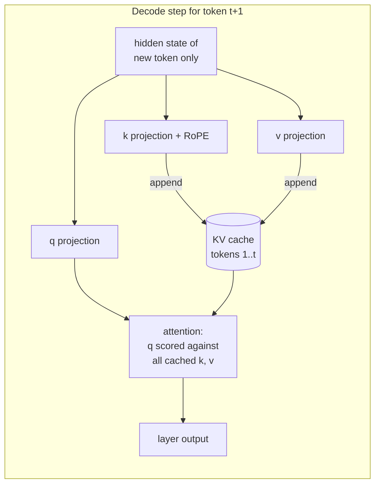
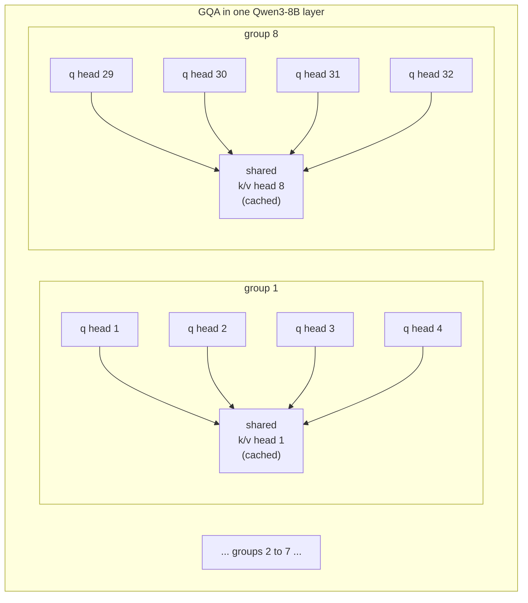

# The KV Cache

**What you will learn.** This document explains the single largest consumer of memory during LLM inference after the model weights: the key-value cache. You will learn why autoregressive attention forces us to keep every past token's keys and values in memory, derive the exact formula for how big that memory is, and compute it concretely for Qwen3-8B on our i7-14650HX / RTX 5060 8 GB machine at 4k, 16k, and 32k context. You will also see how grouped-query attention already shrank the cache 4x before we touched anything, what quantizing the cache to Q8_0 buys us, and how llama.cpp manages a full cache compared to the PagedAttention approach used in datacenter serving stacks like vLLM.

## Why attention needs the past

A decoder-only transformer generates text one token at a time. To predict token `t+1`, every attention layer computes, for the current token, a query vector `q`, and then scores that query against the key vector `k_i` of every token `i <= t` seen so far. The scores are softmaxed into weights, and the output is a weighted sum of the value vectors `v_i` of all those past tokens:

```
attention_output = softmax(q · [k_1 ... k_t] / sqrt(d)) · [v_1 ... v_t]
```

The critical observation: `k_i` and `v_i` for a past token `i` depend only on that token's hidden state, which never changes once the token is in the sequence. In a causal model, token 5 cannot attend to token 6, so nothing that happens later ever modifies token 5's keys or values.

That gives us two options for each new token:

1. **Recompute everything.** Run the full forward pass over all `t` tokens to regenerate their keys and values, just to score one new query against them. Generating a sequence of length `n` then means n forward passes, each over up to n tokens, so O(n^2) token computations, and since attention inside each pass is itself quadratic in its input length, O(n^3)-ish total work. Generating token 2,000 would mean redoing the work for tokens 1 through 1,999.
2. **Cache K and V.** Compute each token's keys and values exactly once, store them, and for every new token run the forward pass on just that one token, reading the stored K and V tensors for the attention step.

Every serious inference engine, llama.cpp included, does option 2. This is the KV cache. It converts generation from quadratic recomputation into a linear scan over stored memory, and it is the reason the decode phase is memory-bandwidth bound rather than compute bound: each generated token must stream the weights plus the entire cache through the memory system.



Note what is not cached: the query. The query of a past token is never needed again, because attention is only ever computed from the perspective of the newest token. Only K and V survive, which is where the leading factor of 2 in the memory formula comes from.

## What exactly is cached

For each transformer layer, the cache holds two tensors:

- **K tensor:** shape `[context_length, n_kv_heads, head_dim]`, the key vectors after the `W_k` projection and after RoPE positional rotation has been applied.
- **V tensor:** same shape, the value vectors after the `W_v` projection. No positional encoding is applied to values.

So the cache stores post-projection, position-encoded activations, not raw hidden states and not weights. Storing K after RoPE matters later: it is why "shifting" the cache when the context window slides requires re-rotating keys instead of just moving memory around.

In llama.cpp, this shows up at startup in lines like `llama_kv_cache: size = 576.00 MiB` (the exact label varies by version). The cache is allocated up front for the full `--ctx-size` you request, whether or not you ever fill it. This is an important practical point on an 8 GB GPU: asking for a 32k context reserves 32k tokens worth of cache immediately.

## The memory formula

The size of the cache is a simple product:

```
bytes = 2 * n_layers * n_kv_heads * head_dim * bytes_per_element * context_length
```

Reading it factor by factor:

- **2**: one K tensor and one V tensor.
- **n_layers**: every layer has its own attention block with its own cache. Nothing is shared across layers.
- **n_kv_heads * head_dim**: the width of the K (or V) vector per token per layer. Note this is the number of KV heads, not query heads. This distinction is the entire GQA story below.
- **bytes_per_element**: 2 for FP16, about 1.0625 for Q8_0 (explained below).
- **context_length**: one K and one V entry per token position.

For Qwen3-8B the relevant architecture numbers are:

- `n_layers` = 36
- `n_heads` (query) = 32
- `n_kv_heads` = 8
- `head_dim` = 128

### Per-token cost first

It is easiest to compute the cost of one token and scale up:

```
elements per token = 2 * 36 * 8 * 128 = 73,728 elements
FP16:  73,728 * 2 bytes       = 147,456 bytes = 144 KiB per token
Q8_0:  73,728 * 1.0625 bytes  =  78,336 bytes = 76.5 KiB per token
```

The Q8_0 factor of 1.0625 bytes per element comes from its block format: Q8_0 stores 32 values as 32 int8 bytes plus one FP16 scale, so 34 bytes per 32 elements, which is 8.5 bits per element.

So every token of context you keep around costs Qwen3-8B **144 KiB** at FP16. A single 2,000-token chat turn is ~281 MiB of cache. This is not a rounding error next to a 5 GB model file.

### Full table for this machine

```
Qwen3-8B KV cache size (36 layers, 8 KV heads, head_dim 128)

Context    FP16 (2 B/elem)          Q8_0 (1.0625 B/elem)
-------    ----------------------   ----------------------
 4,096     603,979,776 B = 576 MiB  320,864,256 B = 306 MiB
16,384     2,415,919,104 B = 2.25 GiB  1,283,457,024 B = 1.20 GiB
32,768     4,831,838,208 B = 4.50 GiB  2,566,914,048 B = 2.39 GiB
```

Worked example for the 4k FP16 cell so you can trust the rest:

```
2 * 36 * 8 * 128 * 2 * 4096
= 73,728 elements/token * 2 B * 4,096 tokens
= 147,456 B/token * 4,096
= 603,979,776 bytes
= 603,979,776 / 1,048,576 = 576 MiB exactly
```

### Why this table hurts on an RTX 5060 8 GB

The Q4_K_M GGUF of Qwen3-8B is about 5.0 GB. Windows and the driver keep several hundred MB of the 8 GB VRAM for themselves, so realistically ~7 GB is usable, and llama.cpp also needs compute buffers (activations, scratch space, typically a few hundred MB more).

That leaves roughly 1 to 1.5 GB for KV cache if everything runs on the GPU. Dividing:

```
FP16:  1.5 GiB / 144 KiB per token  = ~10,900 tokens of context
Q8_0:  1.5 GiB / 76.5 KiB per token = ~20,500 tokens of context
```

So on this exact machine, the KV cache format is the difference between a ~10k and a ~20k usable context with the model fully offloaded. The 32k FP16 cache at 4.5 GiB simply does not fit next to the weights; you would have to spill layers or cache to system RAM and pay a large speed penalty.

### The cache also costs bandwidth, not just capacity

During decode, every generated token must read the model weights plus the entire populated cache from memory. If we ever run this CPU-side on our DDR5-5600 dual channel setup (theoretical ~89.6 GB/s):

```
Empty cache:   89.6 GB/s / 5.0 GB per token           = ~18 tok/s ceiling
Full 32k FP16: 89.6 GB/s / (5.0 + 4.83) GB per token  = ~9 tok/s ceiling
```

(4.5 GiB = 4.83 GB decimal.) A full FP16 cache at 32k roughly halves the theoretical decode speed on CPU, before any real-world inefficiency. Long context is expensive twice: once in capacity, once per token in bandwidth.

## How GQA shrinks the cache

In classic multi-head attention (MHA), every query head has its own K and V head. Qwen3-8B has 32 query heads, so an MHA version would cache 32 KV heads per layer:

```
MHA (hypothetical): 2 * 36 * 32 * 128 * 2 = 589,824 B = 576 KiB per token
                    at 32k context: 18.0 GiB of cache
```

Grouped-query attention (GQA, Ainslie et al. 2023) instead shares each K/V head among a group of query heads. Qwen3-8B uses 8 KV heads for its 32 query heads, so each K/V pair serves a group of 4 query heads. The queries in a group are still all different, they just score against the same keys and read the same values.



The cache shrinks by exactly `n_heads / n_kv_heads` = 32 / 8 = **4x**, which is the difference between 18 GiB and 4.5 GiB at 32k. The extreme version, multi-query attention (MQA, Shazeer 2019), uses a single KV head, a 32x reduction, but costs more quality. GQA is the industry compromise, and it was chosen by the model trainers precisely because inference is KV-bandwidth bound. Every modern open model we care about (Qwen3, Llama 3, Mistral, Gemma) ships with GQA, so our formula must always use `n_kv_heads`, never the headline head count.

The lesson for a systems person: the 4x saving happened at training time and is baked into the checkpoint. Everything we do at inference time (quantization, shifting, paging) stacks on top of it.

## KV cache quantization tradeoffs

llama.cpp lets you set the cache element type per tensor with `--cache-type-k` and `--cache-type-v` (FP16 is the default, `q8_0` and `q4_0` are the common alternatives). Quantizing the V cache requires flash attention (`-fa on`), which is worth enabling anyway.

```
Cache type      bits/elem   32k cache    vs FP16   quality risk
-----------     ---------   ---------    -------   ------------
f16             16          4.50 GiB     1.00x     none (baseline)
q8_0            8.5         2.39 GiB     0.53x     negligible in practice
q4_0            4.5         1.27 GiB     0.28x     measurable, task dependent
```

Why the risk profile looks like this:

- **Q8_0 K and V** is close to free. Perplexity changes are typically in the noise, and it is the standard recommendation for VRAM-constrained setups. The arithmetic still happens in higher precision; only storage is 8-bit, dequantized on read.
- **Q4_0, especially on the K cache, is riskier.** Attention scores are dot products against keys, then pushed through a softmax, which amplifies small score errors into large weight changes. Research on KV quantization (KVQuant, KIVI) consistently finds keys more sensitive than values, partly because key channels have strong per-channel outliers that per-block 4-bit formats capture poorly. A common middle ground is `--cache-type-k q8_0 --cache-type-v q4_0`.
- **Degradation grows with context.** A 200-token answer barely exercises the cache; a 30k-token retrieval task reads quantization error tens of thousands of times per generated token. Long-context recall benchmarks (needle-in-a-haystack style) degrade before short-form perplexity does, so we should evaluate cache quantization at the context lengths we actually intend to use.

There is also a small compute cost: quantized cache entries must be dequantized inside the attention kernel, and new K/V vectors must be quantized on write. On GPU this is usually hidden by the bandwidth savings; the cache reads shrink by the same factor as the storage.

For our machine the practical default is clear: **q8_0 for both K and V**, which turns the impossible 4.5 GiB 32k cache into a 2.39 GiB one and roughly doubles the context that fits in the VRAM left over after the weights.

## Context management: what happens when the cache is full

The cache has a hard capacity of `--ctx-size` tokens. When a conversation or generation reaches it, something has to give. llama.cpp's options:

- **Stop.** By default a generation that hits the context limit simply ends (or the request is rejected). Safe, unhelpful for chat.
- **Truncation.** Drop the oldest tokens and keep going. Naive truncation invalidates the cache: since keys were stored after RoPE, position `i` is baked into `k_i`, and if token 500 becomes "the new token 0" its stored key is rotated wrong. The blunt fix is to re-run prefill on the kept suffix, which costs a full prompt-processing pass.
- **Context shifting.** llama-server's smarter version (`--context-shift`). When full, it discards a chunk of the oldest tokens (keeping the first `--keep` tokens, typically the system prompt) and then re-rotates the remaining cached keys in place by the RoPE angle corresponding to how far they moved. Because RoPE is a rotation, shifting position by `d` is just applying the rotation for `-d`, which is cheap linear work over the cache, no re-prefill needed. Values are position-free and just stay put.
- **Attention sinks.** The StreamingLLM observation: models dump a lot of attention mass on the first few tokens, and evicting them collapses quality even when they carry no information. Keeping a handful of initial tokens forever (what `--keep` effectively does) plus a sliding window of recent tokens keeps generation stable over very long streams. llama.cpp's keep-plus-shift design matches this recipe.

The honest caveat: any eviction scheme loses information. Shifting keeps the model fluent, but the evicted middle of the conversation is gone, and the model's positions no longer correspond to the true history. For tasks that need real long-range recall, there is no substitute for a cache big enough to hold the context, which is exactly why the memory table above matters.

## PagedAttention, and what llama.cpp does instead

Datacenter serving has a different problem: hundreds of concurrent requests with unknown final lengths. Reserving a contiguous max-length cache per request wastes enormous memory, since most requests finish early. vLLM's PagedAttention (Kwon et al. 2023) solves it the way an OS solves the same problem for processes: it splits each sequence's cache into fixed-size blocks (16 tokens each), allocates blocks on demand from a shared pool, and keeps a per-sequence block table mapping logical positions to scattered physical blocks. Reported fragmentation waste drops from as much as 60 to 80 percent to about 4 percent, and identical prefixes (a shared system prompt across users) can even point at the same physical blocks, copy-on-write style.

llama.cpp deliberately does something simpler, because its target, our target, is one user on one machine:

- The cache is **allocated contiguously up front** for the full requested `--ctx-size`, sized by the exact formula in this document.
- llama-server supports multiple **parallel sequences** (`--parallel N`) inside that one allocation by dividing the context between slots, with a unified KV cache option that lets slots share the pool dynamically, plus prompt-prefix reuse so a returning chat does not re-prefill its unchanged history.
- There is no demand paging and no block table indirection, which also means no per-block lookup overhead in the attention kernel.

For a single-user local setup this is the right trade. With one or two sequences there is little fragmentation to fight, and the predictable contiguous allocation makes our capacity math exact: we can compute to the MiB how much context fits before we launch. The skill we need is not paging, it is budgeting.

## Why this matters for our research

Our goal is running models larger than our 8 GB of VRAM on cheap hardware, and the KV cache is the second front of that war after the weights. The weights are a fixed cost; the cache is a cost we choose every time we set `--ctx-size` and `--cache-type-*`. On this machine, Qwen3-8B's cache at FP16 costs 144 KiB per token, so a 32k context (4.5 GiB) nearly duplicates the model's own footprint and cannot fit beside the weights in VRAM. Q8_0 cache quantization cuts that to 76.5 KiB per token at essentially no quality cost, and it stacks on the 4x that GQA already gave us for free.

The cache also shapes every speed measurement we will make: decode reads the entire populated cache per token, so tokens/sec is not one number but a curve that falls as context fills. When we later benchmark partial GPU offload for 14B and 30B-class models, deciding whether the cache lives in the RTX 5060's ~448 GB/s GDDR7 or 89.6 GB/s DDR5, and at which precision, will be one of the highest-leverage knobs we have. The formula in this document is the tool that lets us make those choices on paper before burning hours of benchmarks.

## References

- Vaswani et al., "Attention Is All You Need" (2017). https://arxiv.org/abs/1706.03762
- Shazeer, "Fast Transformer Decoding: One Write-Head is All You Need" (MQA, 2019). https://arxiv.org/abs/1911.02150
- Ainslie et al., "GQA: Training Generalized Multi-Query Transformer Models from Multi-Head Checkpoints" (2023). https://arxiv.org/abs/2305.13245
- Kwon et al., "Efficient Memory Management for Large Language Model Serving with PagedAttention" (vLLM, 2023). https://arxiv.org/abs/2309.06180
- Xiao et al., "Efficient Streaming Language Models with Attention Sinks" (StreamingLLM, 2023). https://arxiv.org/abs/2309.17453
- Hooper et al., "KVQuant: Towards 10 Million Context Length LLM Inference with KV Cache Quantization" (2024). https://arxiv.org/abs/2401.18079
- Liu et al., "KIVI: A Tuning-Free Asymmetric 2bit Quantization for KV Cache" (2024). https://arxiv.org/abs/2402.02750
- Qwen Team, "Qwen3 Technical Report" (2025). https://arxiv.org/abs/2505.09388
