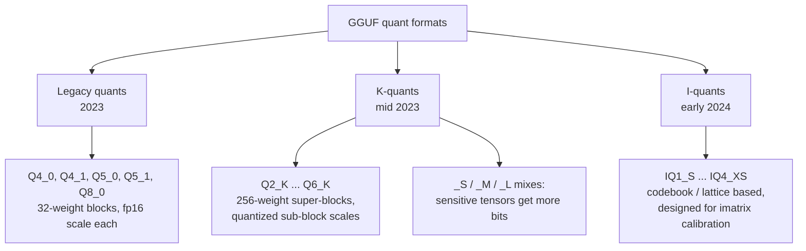
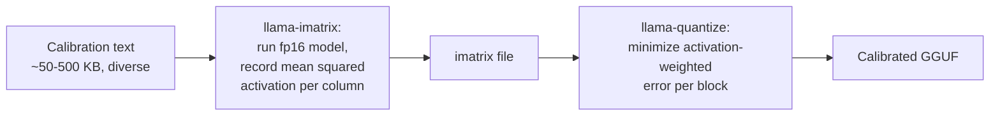

# Quantization: Theory and GGUF Quant Types

**What you will learn.** This document explains why large language model weights survive aggressive precision reduction, and how llama.cpp exploits that fact through its GGUF quantization formats. We cover block-wise quantization from first principles, then walk through the three GGUF families: legacy quants (Q4_0, Q8_0), K-quants (Q4_K_M and friends), and I-quants (IQ4_XS and friends), including importance-matrix calibration. We compute exact bits-per-weight and file sizes for our reference model, Qwen3-8B, and translate those sizes into expected decode speeds on our i7-14650HX and RTX 5060 Laptop GPU. Finally, we look at how quantization quality is measured and when quantization actually starts to hurt.

## Why weights tolerate low precision

A trained transformer stores its knowledge in billions of weights, but no single weight matters much. Each output activation is a dot product over thousands of weights, so independent rounding errors largely cancel: if you perturb each weight by small random noise, the sum of thousands of perturbed products concentrates tightly around the true value. This is the central-limit intuition behind all post-training quantization.

Three properties of trained LLMs make this work in practice:

- **Weights are roughly Gaussian and centered near zero.** Most values in a weight matrix sit in a narrow band. A 4-bit code with a per-block scale can cover that band with small relative error.
- **Redundancy.** Models are heavily overparameterized. Pruning and distillation research shows large fractions of weights can be removed entirely; nudging them by a rounding step is far gentler.
- **The signal lives in directions, not digits.** What matters is the relative pattern across a row of weights (which direction it points in activation space), and that pattern survives coarse rounding as long as the scale is right.

The important exception: a small number of weight columns interact with **activation outliers**, rare channels whose activations are 10x to 100x larger than typical. Errors in those weights get amplified instead of averaged away. This observation, formalized in the LLM.int8() and AWQ papers, is exactly what importance-matrix calibration addresses later in this document.

Precision reduction is therefore not free, it is a trade: we accept a small, measurable increase in prediction error in exchange for a 3-4x smaller model. On memory-bandwidth-bound hardware like ours, smaller also means proportionally faster, which is why quantization is the single highest-leverage technique in this entire research project.

## Block-wise quantization: the core mechanism

Naive quantization would pick one scale for an entire tensor: `q = round(w / scale)`. That fails immediately, because one large outlier weight forces a huge scale and crushes every normal weight into one or two quantization steps.

The fix used by every GGUF format is **block-wise quantization**: split each row of the weight matrix into small blocks (32 or 256 weights), and give each block its own scale, stored in higher precision.

Concrete example, **Q4_0**, the simplest 4-bit format. Take a block of 32 fp32 weights:

1. Find the value with the largest magnitude in the block, `amax`.
2. Compute the scale `d = amax / -8` (4-bit signed codes span -8 to +7).
3. Quantize each weight: `q_i = round(w_i / d)`, clamped to [-8, 7].
4. Store: one fp16 scale (2 bytes) plus 32 4-bit codes (16 bytes) = **18 bytes per 32 weights**.

Dequantization at inference time is just `w_i ≈ q_i * d`. The storage cost works out to:

```
(2 bytes + 16 bytes) * 8 bits / 32 weights = 4.5 bits per weight
```

The extra 0.5 bit over the nominal "4-bit" is the amortized cost of the scale. **Q8_0** is the same idea with 8-bit codes: 2 + 32 = 34 bytes per 32 weights = **8.5 bits per weight**, and its rounding error is small enough to be considered lossless for practical purposes.

Some formats also store a per-block **minimum** (an offset), so codes represent `w ≈ q * d + m` instead of `w ≈ q * d`. That is an asymmetric quantizer, and it helps when a block's values are not centered on zero.

## The GGUF quant families

llama.cpp has accumulated three generations of formats. All of them are block-wise; they differ in block structure, code assignment, and how cleverly the scales themselves are stored.



### Legacy quants: Q4_0, Q8_0

The original formats: 32-weight blocks, one fp16 scale each, uniform (evenly spaced) quantization levels. Q4_1 and Q5_1 add a per-block minimum. They are simple and fast to dequantize, and Q8_0 remains the standard "reference quality" quant; its 8-bit block scheme is also how llama.cpp quantizes activations on the fly for CPU matrix multiplication (as Q8_0, or its 256-weight-block sibling Q8_K when the weights are K-quants). Q4_0 survives mostly because its layout enables very fast SIMD kernels (llama.cpp can repack it at load time into CPU-friendly interleaved layouts), but for quality per bit it has been superseded.

### K-quants: the super-block generation

K-quants (the `_K` suffix) introduced two ideas:

**Super-blocks with quantized scales.** A Q4_K super-block covers 256 weights, divided into 8 sub-blocks of 32. Each sub-block gets its own 6-bit scale and 6-bit minimum, and those 6-bit values are themselves scaled by one fp16 super-scale and one fp16 super-min for the whole super-block. The accounting:

```
256 weights * 4 bits            = 1024 bits
8 scales + 8 mins, 6 bits each  =   96 bits
fp16 super-scale + super-min    =   32 bits
Total: 1152 bits / 256 weights  =  4.5 bits per weight
```

Same 4.5 bpw as Q4_0, and even the same scale budget: Q4_0 spends 128 bits per 256 weights on 8 fp16 scales, while Q4_K spends its 128 bits on 16 six-bit scale/min values plus one fp16 super-scale and super-min. The two-level, asymmetric scheme uses that budget far more efficiently, so quality improves substantially at identical size.

**Mixed-precision recipes.** The `_S`, `_M`, `_L` suffixes are not different formats, they are mixing recipes. **Q4_K_M** stores most tensors in Q4_K but promotes the most damage-sensitive tensors (roughly half of the `attn_v` and `ffn_down` matrices) to Q6_K, and stores the output projection in Q6_K. That is why Q4_K_M averages about 4.85 bpw instead of 4.5. Q6_K itself costs 6.5625 bpw (210 bytes per 256-weight super-block) and sits close enough to Q8_0 in quality that it is the usual choice for the layers you refuse to compress hard.

### I-quants: codebooks and lattices

I-quants (the `IQ` prefix) came out of the push below 4 bits, where uniform grids fall apart. Two ideas:

- **Non-uniform levels.** IQ4_NL and IQ4_XS replace the evenly spaced 16 levels of Q4 with a 16-entry lookup table shaped to the empirical distribution of weights (dense near zero, sparse in the tails), the same insight as the NF4 data type in the QLoRA paper. IQ4_XS packs this into **4.25 bpw**, smaller than Q4_K at similar or better quality.
- **Vector quantization on lattices.** The 2-bit and 3-bit I-quants (IQ2_XXS, IQ2_XS, IQ3_XXS, and the 1.56 bpw IQ1_S) borrow from the QuIP# paper: instead of quantizing weights one at a time, groups of 8 weights are mapped jointly to entries of an E8-lattice-derived codebook (IQ3_XXS does the same with groups of 4 and its own codebook). Joint coding captures correlations that scalar quantization cannot, which is the only reason 2-bit models produce coherent text at all.

The cost: decoding a codebook entry takes table lookups and bit shuffling, which GPUs absorb easily but CPUs feel. **On our machine, I-quants running on the CPU are noticeably slower per byte than K-quants**; they shine on the RTX 5060 where the 448 GB/s of GDDR7 is the binding constraint and the extra ALU work is free.

## Importance-matrix calibration

Everything above minimizes *weight* rounding error, treating every weight equally. But the model does not care about weight error, it cares about *output* error, and outputs weight each column by its activation magnitude. A weight that always multiplies a large activation deserves more precision than one multiplying values near zero.

The **importance matrix** (imatrix) makes this concrete. The pipeline in llama.cpp:



During quantization, the block scale and code assignment are chosen to minimize `sum(importance_i * (w_i - q_i*d)^2)` instead of plain squared error. This is the same philosophy as GPTQ and AWQ, implemented as a data-informed weighting rather than iterative reconstruction.

Two practical notes. First, despite the naming collision, **imatrix is orthogonal to I-quants**: any format, including Q4_K_M, can be quantized with or without an imatrix, and most quants published on Hugging Face today (for example bartowski's) are imatrix-calibrated. Second, imatrix matters more the fewer bits you use. At Q8_0 it is irrelevant; at Q4 it gives a modest but free improvement; below 3.5 bpw it is essentially mandatory, and the sub-2.5 bpw I-quants are not usable without it.

## Bits per weight and file size for Qwen3-8B

File size is just `parameters * bpw / 8`. For our 8.2B-parameter reference model (sizes in GB, decimal; real files run a few percent larger because embeddings and a few tensors are kept at higher precision):

```
Type      | bpw     | Size (8.2B)     | Fits 8 GB VRAM     | Character
----------|---------|-----------------|--------------------|---------------------------
F16       | 16.0    | 16.4 GB         | no                 | baseline, never needed
Q8_0      |  8.5    |  8.7 GB         | no                 | effectively lossless
Q6_K      |  6.5625 |  6.7 GB         | barely, no KV room | near lossless
Q5_K_M    | ~5.7    |  5.8 GB         | tight              | very safe
Q4_K_M    | ~4.85   |  5.0 GB (5.03 actual) | yes, ~3 GB spare | the default sweet spot
Q4_K_S    | ~4.6    |  4.7 GB         | yes                | slightly leaner
IQ4_XS    |  4.25   |  4.4 GB         | yes                | best 4-bit size/quality
Q3_K_M    | ~3.9    |  4.0 GB         | yes                | quality loss now visible
IQ3_XXS   |  3.06   |  3.1 GB         | yes                | needs imatrix, degraded
Q2_K      |  2.63   |  2.7 GB         | yes                | badly degraded
IQ2_XS    |  2.31   |  2.4 GB         | yes                | last resort for huge models
```

The arithmetic for the row we actually use: Q4_K_M at 4.85 bpw gives `8.2e9 * 4.85 / 8 = 4.97e9 bytes ≈ 5.0 GB`, matching the 5.03 GB file on disk.

VRAM budget check for full GPU offload on the RTX 5060 (8 GB): the Qwen3-8B KV cache with GQA costs per token `2 (K and V) * 36 layers * 8 KV heads * 128 head-dim * 2 bytes = 147,456 bytes ≈ 144 KiB`. At 8192 context that is about **1.2 GB**. So Q4_K_M (5.0 GB) + KV (1.2 GB) + compute buffers (~0.7 GB) ≈ **6.9 GB: the entire model fits in VRAM with 8K context**. Q5_K_M at the same context totals about 7.7 GB, right at the edge with no margin for driver overhead; Q6_K plus buffers alone reaches 7.4 GB, leaving no useful KV room. This single table explains why Q4_K_M is the default for this machine.

Loading is a non-issue: the SN5000S reads ~5.5 GB/s sequentially, so paging in a 5 GB model takes on the order of one to two seconds.

## Measuring quality: perplexity and KL divergence

**Perplexity (PPL)** is the classic metric: run the model over a fixed text (WikiText-2 is the convention, via `llama-perplexity`), average the log-probability it assigns to each true next token, and exponentiate. Lower is better; what matters for quantization is the **delta versus the fp16 baseline**, not the absolute number. Representative deltas at the 7-8B scale, from the llama.cpp K-quants measurements:

```
Quant    | PPL delta vs fp16 (approx)
---------|----------------------------
Q8_0     | +0.001  (noise)
Q6_K     | +0.004
Q5_K_M   | +0.02
Q4_K_M   | +0.05   (~1% relative)
Q4_0     | +0.25
Q3_K_M   | +0.24
Q2_K     | +0.5 to +1.0 (imatrix helps most here)
```

The pattern to internalize: quality loss is **flat from 8 down to about 5 bpw, gentle to about 4.25, then falls off a cliff below 3.5**. Q4_K_M sits just uphill of the cliff edge, which is why the community converged on it.

**KL divergence** is the sharper tool. Perplexity only scores the probability of the one true token; two models can have equal perplexity while disagreeing wildly elsewhere in the distribution. `llama-perplexity --kl-divergence` instead compares the quantized model's full next-token distribution against the fp16 model's, token by token, and reports the mean and tail (99th percentile) divergence plus the fraction of positions where the top-1 token changed. It directly answers the question we care about: "how often does the quantized model behave differently from the original", and it exposes tail damage (occasional badly wrong tokens) that averaged perplexity hides. When we evaluate quants in later phases, KL divergence against a Q8_0 reference will be our primary gate, with task benchmarks as a sanity check.

## Speed: fewer bytes moved is faster decode

From the earlier pipeline docs: token-by-token decode is memory-bandwidth-bound, because every generated token requires streaming essentially every weight byte through the compute units once. Therefore, to first order:

```
tokens/sec ≈ effective memory bandwidth / bytes read per token
           ≈ effective bandwidth / model file size
```

For our hardware, taking realistic sustained bandwidth as roughly 65-75% of theoretical (DDR5-5600 dual channel: 89.6 GB/s theoretical, ~60 GB/s realistic; RTX 5060 Laptop GDDR7: 448 GB/s theoretical, ~330 GB/s realistic):

```
Config                       | Bytes/token | Ceiling estimate
-----------------------------|-------------|------------------
CPU, F16 (16.4 GB)           | 16.4 GB     |  60/16.4 ≈  3.7 t/s
CPU, Q8_0 (8.7 GB)           |  8.7 GB     |  60/8.7  ≈  6.9 t/s
CPU, Q4_K_M (5.0 GB)         |  5.0 GB     |  60/5.0  ≈ 12 t/s
GPU, Q4_K_M fully offloaded  |  5.0 GB     | 330/5.0  ≈ 66 t/s
```

Quantizing F16 to Q4_K_M is a **3.3x decode speedup** on identical hardware, purely from moving fewer bytes. No other single technique in this project comes close. (These are ceilings; KV-cache reads, dequant overhead, and our asymmetric 16+32 GB module pair, which interleaves only the first 32 GB at full dual-channel speed, all shave real numbers below them.)

Two caveats. **Prefill is compute-bound**, not bandwidth-bound, so quantization barely changes prompt-processing speed; it can even slow prefill slightly because weights must be dequantized before the batched matmul. And **dequantization cost varies by family**: K-quants decode with cheap integer math, while I-quant codebook lookups cost enough CPU cycles that an IQ4_XS running on our P-cores can lose to Q4_K_M despite being smaller. Rule of thumb for this machine: K-quants for CPU-resident layers, I-quants only for layers living in VRAM.

## When quantization hurts, and which layers stay in higher precision

Quantization damage is not uniform. It concentrates in predictable places:

- **Small and dense models suffer more.** An 8B model has less redundancy per weight than a 70B model, so the same bpw costs more quality. Sub-4-bit quants of 8B models degrade visibly, while a 2.5 bpw quant of a 70B model can still beat any quant of an 8B model that fits in the same memory.
- **Structured tasks fail first.** Casual chat masks damage; code generation, math, and long chains of reasoning expose it, because one wrong token derails the continuation. Perplexity deltas understate this.
- **Outlier-heavy tensors are fragile.** The value projection (`attn_v`) and the FFN down-projection (`ffn_down`) interact most directly with activation outliers. This is exactly why Q4_K_M promotes them to Q6_K.
- **Ends of the network are special.** The output projection (`output.weight`) turns hidden states into logits over 150k+ vocabulary entries; errors there hit every prediction directly, so K-quant recipes keep it at Q6_K minimum. Token embeddings get similar protection in the low-bit recipes. LayerNorm/RMSNorm weights stay in F32 always: for Qwen3-8B they total about 1.2 MB (36 layers times two 4096-wide norms in 4-byte floats), and quantizing them buys nothing.
- **MoE routers stay high precision.** In mixture-of-experts models, the tiny router matrices decide which experts fire; a rounding error there misroutes a whole token, so llama.cpp leaves them unquantized.

The practical failure signature to watch for in our experiments: below ~3.5 bpw without imatrix, models loop, drop into the wrong language, or produce confidently malformed code, long before perplexity numbers look catastrophic. Quality metrics must always be paired with a real generation eyeball test.

## References

- Dettmers et al., *LLM.int8(): 8-bit Matrix Multiplication for Transformers at Scale* (activation outliers): https://arxiv.org/abs/2208.07339
- Frantar et al., *GPTQ: Accurate Post-Training Quantization for Generative Pre-trained Transformers*: https://arxiv.org/abs/2210.17323
- Lin et al., *AWQ: Activation-aware Weight Quantization for LLM Compression and Acceleration*: https://arxiv.org/abs/2306.00978
- Dettmers et al., *QLoRA: Efficient Finetuning of Quantized LLMs* (NF4, non-uniform 4-bit levels): https://arxiv.org/abs/2305.14314
- Tseng et al., *QuIP#: Even Better LLM Quantization with Hadamard Incoherence and Lattice Codebooks* (basis of I-quants): https://arxiv.org/abs/2402.04396
- Dettmers & Zettlemoyer, *The case for 4-bit precision: k-bit Inference Scaling Laws*: https://arxiv.org/abs/2212.09720
- llama.cpp K-quants pull request (format definitions and PPL tables): https://github.com/ggml-org/llama.cpp/pull/1684
- GGUF specification: https://github.com/ggml-org/ggml/blob/master/docs/gguf.md

## Why this matters for our research

Our stated goal is running models larger than 8 GB of VRAM on cheap hardware, and quantization is the reason that goal is plausible at all. The scaling-law result from Dettmers & Zettlemoyer is the strategic anchor: **at a fixed memory budget, a bigger model at ~4 bits beats a smaller model at higher precision.** Our 8 GB RTX 5060 holds Qwen3-8B at Q4_K_M with full 8K context entirely in VRAM at an estimated 60+ tokens/sec, but the same logic scales up: Qwen3-14B at IQ4_XS (14.8B parameters, about 7.9 GB of weights) already overflows 8 GB once KV cache and buffers are added, making it our first partial-offload target, and 30B-class models at 3-4 bpw land in the 12-16 GB range, where our 48 GB of system RAM plus partial GPU offload becomes the battleground. Every technique in later phases (offload splitting, KV-cache quantization, speculative decoding) operates on top of a quant choice, so the Q4_K_M / IQ4_XS / Q5_K_M decision is the first knob we turn in every experiment. Just as important, this document gives us the measurement discipline: bpw determines bytes moved, bytes moved determine decode speed, and KL divergence against a Q8_0 reference tells us what that speed cost us in fidelity. Speed claims without a matching quality measurement are not results, and from Phase 2 onward we will report both, always.
