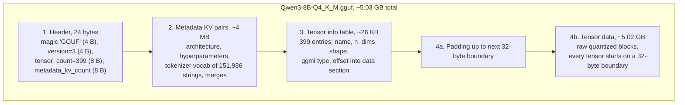
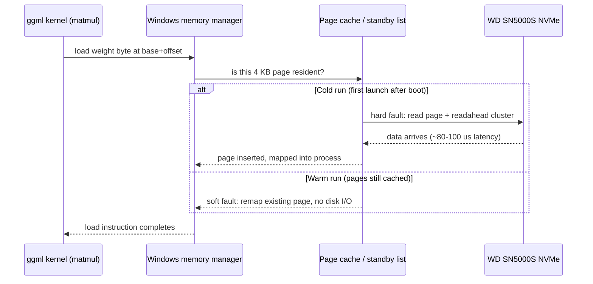

# The GGUF File Format and Memory Mapping

**What you will learn:** This document explains what is actually inside a GGUF file, byte by byte, and why llama.cpp can start generating tokens from a 5 GB model file seconds after you launch it. You will learn the four sections of the file layout, why tensor data is alignment-padded, and how memory mapping (mmap) turns "loading a model" into a lazy conversation between llama.cpp, the Windows memory manager, and our NVMe SSD. We will trace exactly what happens on this machine when Qwen3-8B Q4_K_M is opened, cold and warm, and compute the bandwidth ceilings involved. Finally, we cover what `--no-mmap` and `--mlock` change, and why mmap is the single feature that lets models larger than RAM load at all.

## Why one file, and why it looks the way it does

A Hugging Face model release is a directory: sharded `safetensors` files, `config.json`, `tokenizer.json`, `generation_config.json`, and more. To run it, a framework must parse several files, reconcile them, and hope the versions match. GGUF (the successor to the older GGML/GGJT formats) collapses all of that into a single binary file that contains three kinds of information:

- **The weights**, already quantized into the exact block format the compute kernels consume.
- **The hyperparameters**, layer count, head counts, RoPE settings, everything needed to rebuild the compute graph.
- **The tokenizer**, the full vocabulary and merge rules, embedded as metadata.

Single-file design is not just convenience. It is what makes memory mapping practical: one `CreateFileMapping` call can expose every weight in the model as a flat region of virtual memory, with tensor pointers computed as simple offsets from one base address. It also makes distribution trivial (one download, one checksum) and makes the format self-describing: llama.cpp reads the architecture string from the file and configures itself, no sidecar config needed.

## Anatomy of a GGUF file

GGUF is a little-endian binary format with four sections in a fixed order. Here is the layout for our reference model, Qwen3-8B Q4_K_M (file size about 5.03 GB):



### 1. Header (24 bytes)

Four fields: the magic bytes `GGUF`, a `uint32` version (currently 3), a `uint64` tensor count, and a `uint64` metadata KV count. That is the entire fixed structure. Everything else is described by the metadata that follows, which is why new architectures rarely require a format change.

### 2. Metadata key-value pairs

An array of typed KV pairs. Keys are length-prefixed UTF-8 strings, values are one of 13 types (integers, floats, bool, string, and arrays of those). For Qwen3-8B you will find entries like:

```
general.architecture           = "qwen3"
general.file_type              = 15          (Q4_K_M)
qwen3.block_count              = 36
qwen3.embedding_length         = 4096
qwen3.feed_forward_length      = 12288
qwen3.attention.head_count     = 32
qwen3.attention.head_count_kv  = 8           (GQA, 4:1 ratio)
qwen3.attention.key_length     = 128
tokenizer.ggml.tokens          = [array of 151,936 strings]
tokenizer.ggml.merges          = [array of merge-rule strings]
```

The tokenizer arrays dominate this section. At roughly 15 bytes per entry (8-byte length prefix plus the token text), 151,936 tokens plus a similar number of merges come to about 4 MB. Compared to the 5 GB of weights this is a rounding error, but it means a GGUF file is fully self-contained: no `tokenizer.json` ships alongside it.

### 3. Tensor info table

One compact entry per tensor: a name string (for example `blk.17.ffn_down.weight`), the number of dimensions, the shape, the ggml quantization type, and a `uint64` offset. The offset is relative to the start of the tensor data section, not the start of the file, so a tool that edits metadata (which shifts where the data section starts) never has to recompute the 399 stored offsets.

Qwen3-8B has 399 tensors: 11 per layer (attention q/k/v/output, the Qwen3-specific q-norm and k-norm, attention norm, FFN gate/up/down, FFN norm) times 36 layers, plus the token embedding, final norm, and output projection. At roughly 65 bytes per entry the whole table is about 26 KB. llama.cpp parses sections 1 to 3 with ordinary buffered reads in milliseconds.

### 4. Aligned tensor data

After the info table the file is padded to the next multiple of the alignment value (metadata key `general.alignment`, default 32 bytes), and every tensor's offset within the data section is also a multiple of 32. The weights are stored exactly as the kernels consume them: for Q4_K, in 256-weight "super-blocks" of 144 bytes each (covered in the quantization doc).

## Why alignment matters

Alignment costs almost nothing (at most 31 wasted bytes per tensor, about 12 KB across the whole file) and buys two things:

- **SIMD loads.** The CPU kernels process weights with 32-byte AVX2 vector loads (and 64-byte AVX-512 loads on machines that have it). A 32-byte load from a 32-byte-aligned address never straddles one of the i7-14650HX's 64-byte cache lines, so an aligned tensor base keeps the common case split-free. The kernels do issue unaligned-load instructions for safety (a Q4_K super-block is 144 bytes, not a multiple of 32, so consecutive blocks within a tensor alternate alignment), but on modern cores an unaligned-load instruction at an aligned address runs at full speed, so alignment still pays.
- **Zero-copy mapping.** Because the data is aligned in the file, a pointer computed as `mapping_base + data_start + tensor_offset` is itself a correctly aligned pointer that kernels can use directly. No repacking, no memcpy into an aligned buffer. The file on disk *is* the runtime weight buffer.

That second point is the entire trick behind the next section.

## Memory mapping: loading without loading

A quick virtual memory refresher. Every process sees a private virtual address space (128 TB of user space on 64-bit Windows). The OS maps virtual pages (4 KB on Windows) to physical RAM on demand. A file mapping tells the OS: "this 5.03 GB range of my address space is backed by that file on disk." Crucially, creating the mapping moves zero bytes. Physical RAM gets involved only when a page is first touched.

On Windows, llama.cpp's loader (`llama-mmap.cpp`) does the equivalent of:

1. Open the file and parse header, metadata, and tensor info with normal reads (a few MB).
2. `CreateFileMapping(hFile, PAGE_READONLY, ...)` to create a section object backed by the GGUF file.
3. `MapViewOfFile(FILE_MAP_READ, ...)` to map the entire file into the address space. This reserves 5.03 GB of virtual addresses, out of 128 TB available, and consumes no physical RAM yet.
4. `PrefetchVirtualMemory(...)` (Windows 8+) to hint the memory manager to start streaming the whole range in sequentially, at full NVMe speed, in the background.
5. Set every ggml tensor's data pointer to `base + data_offset + tensor_offset`. "Loading" is now done from llama.cpp's point of view.

On Linux and macOS the same flow uses `mmap(PROT_READ)` plus `madvise(MADV_WILLNEED)`. The behavior is equivalent.

The prefetch step matters more than it looks. A hard page fault serviced one 4 KB page at a time at queue depth 1 costs roughly 80 to 100 microseconds on our WD SN5000S, which works out to only about 4096 B / 90 us = 45 MB/s. Faulting 5.03 GB that way would take almost two minutes. Sequential prefetch instead drives the SSD at its ~5.5 GB/s sequential rate, so the same 5.03 GB streams in, in about 0.9 seconds of pure disk time.

## The page cache: first token versus warm runs

When a mapped page is read from disk it does not belong to llama.cpp. It goes into the OS page cache (on Windows, these physical pages show up in the process working set while in use and move to the standby list when the process exits or memory pressure rises). This produces the cold/warm asymmetry every llama.cpp user notices:



- **Cold run:** the first forward pass touches every layer's weights, so any page the prefetch has not delivered yet is hard-faulted in. In practice on this machine a cold load of the 5.03 GB file takes about 1 to 3 seconds (prefetch running near sequential speed, plus fault overhead), and time-to-first-token includes whatever is still in flight.
- **Warm run:** kill the server, relaunch it, and the model appears to load instantly. Every one of the ~1.23 million pages (5.03 GB / 4 KB = 1,228,027 pages) is still sitting in the standby list, so faults are soft: the memory manager just wires existing physical pages back into the new process. No disk I/O at all. Load time drops well under half a second.

A practical Windows note: with mmap, Task Manager shows llama-server using surprisingly little memory. The 5 GB lives as file-backed cached memory, not private commit charge, so it appears under "Cached" in the Memory tab (RAMMap shows it precisely as a mapped file). This confuses people into thinking the model "is not really loaded." It is loaded, it is just accounted as cache the OS is free to reclaim.

## Why mmap lets models larger than RAM load at all

With a classic `malloc` + `read` loader, loading a 70 GB model on our 48 GB machine fails outright: there is no way to allocate the buffer (short of pushing tens of GB through the pagefile, which is the same disk traffic with worse ergonomics). With mmap there is nothing to allocate. The mapping reserves 70 GB of *address space* (out of 128 TB), and the OS keeps only the touched pages resident, evicting least-recently-used pages under pressure. The model loads, and inference runs; the only question is speed.

The speed question has a brutal answer for dense models. Each generated token reads every weight once, front to back. Cyclic access over a working set larger than the cache is the worst case for LRU: by the time you loop back to layer 0, its pages have been evicted, so nearly every page comes from the SSD. Ceiling: 5.5 GB/s / 70 GB = 0.08 tokens/sec. Loadable, not usable.

But the same math flips for sparse models. A mixture-of-experts model like Qwen3-30B-A3B activates only about 3.3B of its 30.5B parameters per token, roughly 2 GB of a ~18 GB Q4 file. The hot experts and shared layers stay resident in the page cache while cold experts live on disk, and the OS does this eviction management for free, purely as a consequence of mmap. This is precisely the direction our research exploits later, and it is the same insight formalized in Apple's "LLM in a flash" paper (see References).

## What --no-mmap and --mlock change

llama.cpp exposes two flags that override the default lazy behavior:

```
+-------------------+----------------------------+---------------------------+---------------------------+
|                   | default (mmap)             | --no-mmap                 | mmap + --mlock            |
+-------------------+----------------------------+---------------------------+---------------------------+
| Load mechanism    | MapViewOfFile, lazy faults | malloc + read whole file  | MapViewOfFile+VirtualLock |
| Load time (cold)  | ~1-3 s (prefetch+faults)   | ~1-2 s (sequential read)  | ~1-3 s, then lock pass    |
| Load time (warm)  | <0.5 s (soft faults)       | ~1-2 s again (must copy)  | <0.5 s                    |
| RAM accounting    | file-backed cache          | private commit charge     | locked working set        |
| Evictable?        | yes, page by page          | only via pagefile swap    | no, pinned in RAM         |
| Model > RAM?      | loads, runs (slowly)       | fails or thrashes pagefile| lock fails, runs as mmap  |
+-------------------+----------------------------+---------------------------+---------------------------+
```

- **--no-mmap** allocates a private buffer and reads the file into it. You lose warm restarts (every launch re-copies 5 GB) and the memory becomes commit charge counted against the pagefile. The main legitimate uses: forcing all weights into RAM up front so first-token latency is never paid mid-generation, and some full-GPU-offload scenarios where staging through a private buffer is preferable to faulting through the cache.
- **--mlock** keeps mmap but pins the pages. On Windows this is `VirtualLock`, and llama.cpp first raises the process working set quota (`SetProcessWorkingSetSize`) so locking 5 GB is allowed. The point is to forbid the OS from evicting model pages when Chrome or a game applies memory pressure, which otherwise silently degrades tokens/sec as evicted pages hard-fault back in mid-generation. On our 48 GB machine, locking a 5 GB model is harmless; locking a 40 GB model would starve everything else.

Default mmap is the right choice almost always on this machine. Reach for `--mlock` when you see tokens/sec mysteriously sag while other applications are busy.

## Walk-through: opening the 5 GB Qwen3 GGUF on this machine

Putting it all together, here is the full timeline when we run `llama-server -m Qwen3-8B-Q4_K_M.gguf` on Windows 11 with the SN5000S:

1. **t = 0 ms:** file opened, header (24 bytes) read. llama.cpp learns: 399 tensors, ~30 KV pairs.
2. **t ~ 50 ms:** the ~4 MB of metadata and 26 KB tensor table are parsed. Tokenizer (151,936 tokens) is built in RAM. Architecture "qwen3" selects the graph builder: 36 layers, 32 heads, 8 KV heads.
3. **t ~ 60 ms:** `CreateFileMapping` + `MapViewOfFile` reserve 5.03 GB of virtual address space. Physical RAM used by weights so far: 0 bytes.
4. **t ~ 60 ms:** `PrefetchVirtualMemory` is issued for the whole mapping. The memory manager starts streaming the file at close to 5.5 GB/s; full residency will take roughly 0.9 to 1.5 seconds of disk time.
5. **t ~ 100 ms:** all 399 tensor pointers are assigned as offsets from the mapping base. With GPU offload (`-ngl`), offloaded layers are copied from the mapping into the RTX 5060's VRAM over PCIe; those host pages will not be touched again and quietly age out of the cache. CPU-resident layers keep pointing into the mapping.
6. **First prompt:** the prefill pass touches every CPU-side weight. Any page the prefetch has not delivered yet hard-faults, with Windows clustering reads so the SSD stays near sequential speed. After this pass the model is fully resident.
7. **Steady state decode:** every token re-reads the CPU-side weights from the page cache at RAM speed. The ceiling on this machine for a fully CPU-resident run is 89.6 GB/s / 5.03 GB = 17.8 tokens/sec, with 11 to 12 tokens/sec realistic at 60 to 70 percent achieved bandwidth. If those pages instead had to stream from the SSD every token, the ceiling would be 5.5 / 5.03 = 1.1 tokens/sec, which is exactly why the page cache is doing most of the work.
8. **Process exits, relaunch:** all 1.23 million pages sit on the standby list. The next launch soft-faults them back and the model is serving in well under a second.

### Key numbers for this machine

```
+---------------------------------------------+---------------------+
| Quantity                                    | Value               |
+---------------------------------------------+---------------------+
| Qwen3-8B Q4_K_M file size                   | ~5.03 GB            |
| Effective bits per weight (5.03e9*8/8.2e9)  | ~4.9 bits           |
| GGUF header size                            | 24 bytes            |
| Metadata section (tokenizer-dominated)      | ~4 MB               |
| Tensor info table (399 tensors x ~65 B)     | ~26 KB              |
| Default alignment                           | 32 bytes            |
| 4 KB pages in the mapping                   | ~1,228,000          |
| Cold sequential load floor (5.03/5.5)       | ~0.91 s             |
| Naive QD1 4 KB faulting (no readahead)      | ~45 MB/s, ~110 s    |
| Warm reload                                 | < 0.5 s             |
| CPU decode ceiling (89.6/5.03)              | 17.8 tok/s          |
| SSD-streaming decode ceiling (5.5/5.03)     | 1.1 tok/s           |
| Dense 70 GB model, thrashing decode         | ~0.08 tok/s         |
+---------------------------------------------+---------------------+
```

## References

- GGUF format specification, ggml project: https://github.com/ggml-org/ggml/blob/master/docs/gguf.md
- llama.cpp source, memory-mapped loading (`llama-mmap.cpp`): https://github.com/ggml-org/llama.cpp
- Alizadeh et al., "LLM in a flash: Efficient Large Language Model Inference with Limited Memory" (2023): https://arxiv.org/abs/2312.11514
- Song et al., "PowerInfer: Fast Large Language Model Serving with a Consumer-grade GPU" (2023): https://arxiv.org/abs/2312.12456
- Kwon et al., "Efficient Memory Management for Large Language Model Serving with PagedAttention" (2023): https://arxiv.org/abs/2309.06180
- Frantar et al., "GPTQ: Accurate Post-Training Quantization for Generative Pre-trained Transformers" (2022): https://arxiv.org/abs/2210.17323
- Qwen Team, "Qwen3 Technical Report" (2025): https://arxiv.org/abs/2505.09388

## Why this matters for our research

Our goal is running models much larger than the RTX 5060's 8 GB VRAM on cheap hardware, and mmap is the load-bearing mechanism for every strategy we will test. It gives us free tiering: VRAM holds offloaded layers, the page cache holds the hot CPU-side weights, and the SSD holds everything else, with the OS moving pages between the last two tiers automatically. The numbers above define the playing field precisely: 89.6 GB/s of RAM bandwidth buys up to ~18 tok/s per 5 GB of weights read per token, while 5.5 GB/s of SSD bandwidth buys only ~1 tok/s per 5 GB, so any viable large-model configuration must keep the per-token working set inside RAM and VRAM. That immediately explains why a dense model with a 70 GB file thrashes to ~0.08 tok/s on this machine, and why sparse MoE models, which touch only a few GB of experts per token, are the realistic path to "bigger than RAM" performance. Later experiments (partial offload ratios, MoE expert caching, `--mlock` under memory pressure, draft-model speculation) all reduce to managing which pages of a GGUF mapping stay hot, so understanding this file-to-page pipeline is a prerequisite for everything that follows.
