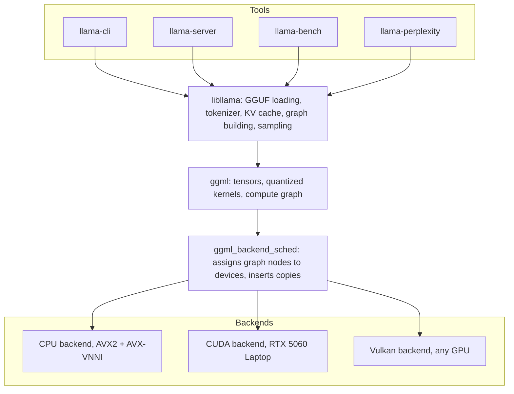
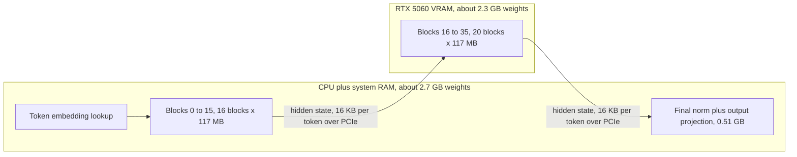
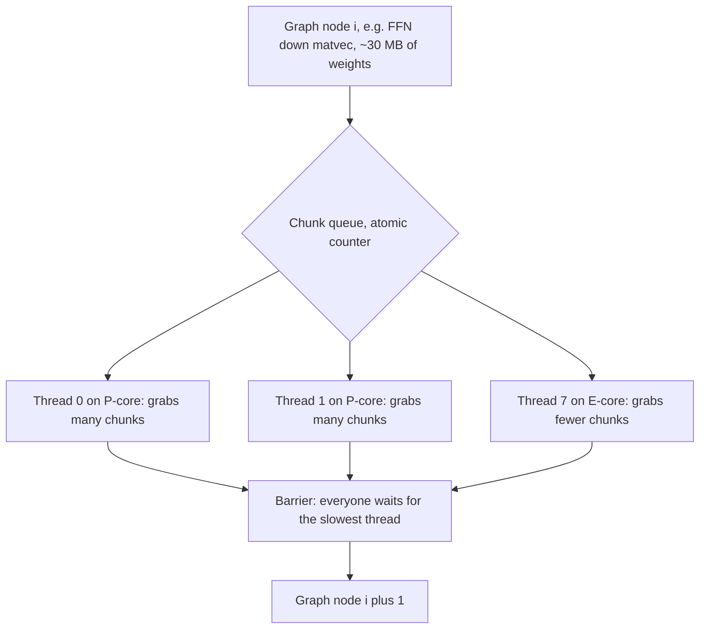

# llama.cpp Architecture: ggml, Backends, and Offloading

**What you will learn.** This document explains how llama.cpp is actually put together: the ggml tensor library at its core, the static compute graph it builds for every forward pass, and the backend abstraction that lets the same graph run on a CPU, a CUDA GPU, or a Vulkan device. You will see exactly how the `-ngl` flag splits a model between our RTX 5060 Laptop GPU and system RAM, what really crosses the PCIe bus during hybrid inference, and why offloading half a model rarely gives you half the speedup. You will also see how ggml's thread pool actually schedules work across the 8 P-cores and 8 E-cores, and what Windows 11 and Intel Thread Director do with those threads. We finish with the practical tool ecosystem (llama-cli, llama-server, llama-bench, llama-perplexity) and concrete throughput ceilings computed for our i7-14650HX / 48 GB DDR5 / 8 GB VRAM machine. Every number here is derived from this hardware and our reference model, Qwen3-8B at Q4_K_M.

## The big picture: what llama.cpp actually is

llama.cpp is not one program. It is a small C/C++ stack with three distinct levels:

1. **ggml**, a dependency-free tensor library that defines tensor types, quantization formats, and compute kernels.
2. **libllama**, the library layer that knows what a transformer is: it parses GGUF files, tokenizes, manages the KV cache, builds the per-token compute graph out of ggml ops, and runs sampling.
3. **The tools**, thin executables (llama-cli, llama-server, llama-bench, llama-perplexity) that link against libllama.



The key design decision: everything above the backend line is device-agnostic. libllama describes *what* to compute; the backend scheduler decides *where* each piece runs.

## ggml: the tensor library underneath

ggml is a plain C library with no external dependencies. Three properties matter for us:

- **First-class quantized types.** Q4_K, Q5_K, Q6_K, Q8_0 and friends are native tensor types, not an afterthought. Kernels multiply quantized weights against float activations directly, dequantizing block by block inside the innermost loop. Weights are never expanded to a full FP16 copy in memory. This is why a 5 GB Q4_K_M file needs roughly 5 GB of memory, not 16 GB.
- **Memory-mapped model loading.** GGUF files are `mmap`-ed by default. The OS pages weights in on first touch, so "loading" a 5 GB model takes about a second of wall time and the file's pages can be shared and evicted like any file cache. Layers destined for the GPU are copied into VRAM once at startup.
- **Preallocated buffers, zero allocation per token.** All working memory (weights, KV cache, activation scratch) is sized and allocated up front. The steady-state decode loop performs no heap allocation at all.

## Static compute graphs

For every forward pass, libllama builds a ggml compute graph (`ggml_cgraph`): a flat, topologically ordered list of nodes where each node is one op (matmul, RMSNorm, RoPE, softmax, add, and so on) pointing at its input tensors. For Qwen3-8B that graph is roughly 30 ops per layer times 36 layers, plus embedding and output head, on the order of 1,100 nodes.

"Static" here means the graph is fully known before execution starts. There is no autograd, no dynamic control flow, no operator dispatch decided mid-flight. That buys three things:

- The scheduler can plan the entire pass ahead of time: which backend runs which node, and where cross-device copies must be inserted.
- Scratch memory can be reused aggressively, because tensor lifetimes are known. Activation buffers for a whole 36-layer pass fit in a few hundred MB.
- Kernel launches can be queued back to back on the GPU with no host round trips between ops.

The graph is rebuilt each batch (its shape depends on batch size and current KV length), but rebuilding is microseconds of pointer bookkeeping, not compilation.

## Backends: CPU, CUDA, Vulkan

A ggml backend implements buffer allocation on a device plus the op kernels. The `ggml_backend_sched` layer splits one graph across several backends and inserts tensor copies at the seams.

**CPU backend.** Hand-written SIMD kernels selected at runtime. On our i7-14650HX (Raptor Lake HX refresh) the usable paths are AVX2, FMA, and AVX-VNNI for int8 dot products. ggml also has AVX-512 kernels, but consumer 13th/14th gen Intel parts have AVX-512 fused off, so this machine runs the AVX2 path. That is worth internalizing: buying a CPU with AVX-512 or AMX changes which kernels you get, but for token generation it barely matters, because decode is limited by DRAM bandwidth, not ALU throughput.

**CUDA backend.** The fast path for NVIDIA hardware. Uses cuBLAS or custom kernels for quantized matmuls, FlashAttention-style fused attention kernels, and keeps offloaded layer weights plus their KV cache slices resident in VRAM. On our Blackwell RTX 5060 Laptop this is the backend to use.

**Vulkan backend.** Same role as CUDA but written against the cross-vendor Vulkan compute API. It runs on NVIDIA, AMD, and Intel GPUs, including iGPUs, with no CUDA toolkit installed. On NVIDIA it is usually 10 to 30 percent slower than the CUDA backend, but it is the portability story, and it matters for our research because cheap hardware is often AMD or Intel graphics.

Bandwidth is the number that separates these devices on our machine:

```
Device                      Peak BW        Realistic BW   Notes
--------------------------  -------------  -------------  ---------------------------------
RTX 5060 Laptop GDDR7       448 GB/s       ~380 GB/s      128-bit bus at 28 Gbps
DDR5-5600 dual channel      89.6 GB/s      ~60-65 GB/s    16+32 GB mixed modules, see note
PCIe 5.0 x8 (CPU to GPU)    31.5 GB/s      ~25 GB/s       per direction
SSD (WD SN5000S, PCIe 4.0)  ~6 GB/s        ~5 GB/s        only touched at load or page-in
```

Note on our RAM: 16 GB + 32 GB mixed modules run in "flex mode". The first 32 GB interleaves across both channels at full dual-channel speed; the last 16 GB is effectively single channel at ~44.8 GB/s. Keeping the model inside the fast region is one reason not to run this machine near RAM capacity.

The hierarchy is roughly 6:1 between VRAM and RAM, and 2.5:1 between RAM and PCIe. Every offloading decision is an attempt to move bytes-read-per-token up this hierarchy.

## Layer offloading with -ngl

A transformer is a stack of identical blocks, which makes it naturally sliceable. `-ngl N` (number of GPU layers) tells llama.cpp to place the **last N** transformer blocks, their weights and their KV cache slices, in VRAM. Everything else (embedding table, the first `36 - N` blocks, and the output head unless `N >= n_layers + 1`) stays in system RAM and runs on the CPU backend.

First, the per-layer budget for Qwen3-8B Q4_K_M, computed from the architecture:

- Total parameters: 8.2B. Embedding table: 151,936 vocab x 4,096 hidden = 0.62B params. The output head is untied, another 0.62B.
- Remaining ~6.95B params across 36 blocks = ~193M params per block.
- Q4_K_M averages ~4.85 bits per weight, so one block is 193M x 4.85 / 8 = **~117 MB**.
- Embedding ~0.35 GB, output head (kept at Q6_K in Q4_K_M files) ~0.51 GB. Total ~5.07 GB, matching the ~5 GB file.

KV cache, thanks to GQA (8 KV heads, head dim 128, FP16): 2 x 8 x 128 x 2 bytes = **4 KB per layer per token**, 144 KB per token across all 36 layers, so **about 1.2 GB (1152 MiB) at 8,192 context**.

## The -ngl 20 split on our machine

Here is the exact split for `llama-cli -m qwen3-8b-q4_k_m.gguf -ngl 20 -c 8192`:



VRAM budget at 8K context:

```
VRAM item                       Size       Arithmetic
------------------------------  ---------  ------------------------------------
Weights, blocks 16-35           2.34 GB    20 x 117 MB
KV cache, blocks 16-35          0.67 GB    20 layers x 8192 tok x 4 KB
Compute buffer (activations)    ~0.4 GB    depends on -ub, batch scratch
CUDA context + fragmentation    ~0.4 GB    fixed cost of the runtime
------------------------------  ---------  ------------------------------------
Total                           ~3.8 GB    fits easily in 8 GB
```

An honest aside: Qwen3-8B at Q4_K_M **fully fits** in 8 GB, so on this machine you would run it with `-ngl 37` (36 blocks + 1 to include the output head). The VRAM bill is then 4.7 GB of weights (36 blocks plus the output head; the 0.35 GB embedding table always stays in system RAM) + 1.2 GB KV + ~0.8 GB of compute buffers and CUDA context = ~6.7 GB. We use `-ngl 20` here as a teaching stand-in for the models this project actually cares about, 14B to 32B class models where partial offload is forced.

## What crosses the PCIe bus, and why partial offload disappoints

During **token generation (decode, batch 1)**, remarkably little crosses the bus. The CPU computes blocks 0 to 15 against RAM-resident weights, then ships one hidden state vector to the GPU: 4,096 FP32 values x 4 bytes = **16 KB** (ggml keeps activations in FP32 at backend boundaries). The GPU runs blocks 16 to 35 out of VRAM and ships 16 KB back for the output projection. That is ~32 KB per token; at 20 tokens/sec it is 640 KB/s on a link that can do 25 GB/s. PCIe bandwidth is nowhere near the bottleneck in decode.

So why is partial offload disappointing? Because the pipeline is **serial** and the CPU portion runs at RAM speed. Decode is memory-bandwidth bound: time per token is approximately bytes-of-weights-read divided by bandwidth, summed over both devices. One subtlety: the 0.35 GB embedding table does not count, because the lookup reads a single ~2 KB row per token. What gets read every token is the 36 blocks plus the 0.51 GB output head, 4.72 GB in total, split between the devices by `-ngl`.

```
Config            Bytes/token (GPU + CPU)   Time/token ceiling            Ceiling tok/s   Realistic
----------------  ------------------------  ----------------------------  --------------  ----------
-ngl 0 (CPU)      0 + 4.72 GB               4.72/62      = 76.1 ms        ~13.1           8-10
-ngl 20 (hybrid)  2.34 GB + 2.38 GB         2.34/448 + 2.38/62
                                            = 5.2 + 38.4 = 43.6 ms        ~22.9           13-16
-ngl 37 (full)    4.72 GB + ~0              4.72/448     = 10.5 ms        ~95             55-70
```

(Using 62 GB/s realistic RAM bandwidth and 448 GB/s VRAM bandwidth. Realistic figures are lower than ceilings because attention, KV reads, sampling, and synchronization add overhead.)

Read that middle row carefully. We offloaded 20 of 36 blocks, **about half of the per-token weight bytes** (2.34 of 4.72 GB), to a GPU with **7x the bandwidth**, and the ceiling moved from 13.1 to 22.9 tokens/sec: a **1.75x** speedup. This is Amdahl's law in memory-bandwidth form. Even with an infinitely fast GPU, the ceiling is total CPU bytes over RAM bandwidth: 2.38/62 = 38.4 ms, so at most 4.72/2.38 = **1.98x** over CPU-only. The slow serial fraction dominates the moment any layers stay behind. Each additional offloaded layer removes 117 MB / 62 GB/s = ~1.9 ms per token, which is why the last few layers you offload save exactly as many milliseconds as the first few, and why tokens/sec versus `-ngl` climbs only gradually until the final jump to full offload.

**Prompt processing (prefill) is different.** With a large batch, matmuls become compute bound, and the CUDA backend applies a trick: for batches above a threshold (around 32 tokens) it can copy the weights of CPU-resident layers over PCIe and run those matmuls on the GPU anyway. Then the bus does real work: our 16 CPU blocks are 16 x 117 MB = 1.87 GB streamed per microbatch pass, ~75 ms at 25 GB/s. That price is paid per microbatch, but the GPU's compute advantage on a 512-token batch usually still wins over AVX2. This is also why `--no-kv-offload` (KV in RAM with GPU compute) hurts decode badly: it forces attention inputs across the bus every single token.

## Threading: how ggml schedules work on 8 P-cores and 8 E-cores

The i7-14650HX exposes 24 logical CPUs of two very different kinds: 8 P-cores (Raptor Cove, 2 hyperthreads each, up to 5.2 GHz) and 8 E-cores (Gracemont, 1 thread each, up to 3.7 GHz). `-t` looks like a trivial flag, but what it controls sits at the intersection of ggml's execution model, the Windows 11 scheduler, Intel Thread Director, and the physics of DRAM. This section walks the whole chain, then predicts the scaling curve before we ever run llama-bench.

### The execution model: fork, chunk, barrier

ggml's CPU backend does not assign different graph ops to different threads. All worker threads walk the **same** graph in lockstep, and every op is computed cooperatively:

- **Within an op**, each thread takes a slice. Small ops use a static split: thread `i` of `n` processes its fixed share of rows. Large matmuls use **dynamic chunking**: the op is cut into chunks of output rows, and threads grab the next chunk by atomically incrementing a shared counter. A fast P-core simply consumes more chunks than a slow E-core, which is work stealing in its simplest form.
- **Between ops**, every thread waits at a **barrier**. No thread may start node `i+1` until all threads finish node `i`, because node `i+1` may read any part of node `i`'s output. (Depending on build flags, the threads are driven by OpenMP or by ggml's own threadpool; the fork-chunk-barrier model is identical either way.)



Now put numbers on it. The Qwen3-8B graph is ~1,100 nodes, so decode executes **~1,100 barriers per token**. The op sizes span four orders of magnitude: the largest single op is a 50M-parameter FFN matvec, about 30 MB at Q4_K_M, roughly 0.5 ms of DRAM time shared across all threads at 62 GB/s. The smallest, an RMSNorm over 4,096 floats, is about a microsecond of total work. For those tiny ops the barrier is most of the cost, and dynamic chunking cannot help because there is nothing to chunk. This is why the **straggler effect** survives: chunking rebalances the big matmuls, but the hundreds of small ops still use static splits, and every one of them waits for the slowest core.

### What a barrier costs, and why oversubscription is poison

A spin barrier between 8 cooperative threads costs roughly 1 to 2 microseconds. At 1,100 barriers that is **~1.7 ms per token, about 2 percent** of the 76 ms CPU-only token budget: annoying but acceptable.

The disaster case is a thread that loses its core. If Windows preempts one worker (a browser tab, an update service, anything), the other threads spin at the barrier while the victim waits **milliseconds** to be rescheduled. One preemption costs more than a hundred clean barriers. The probability that at least one of your threads is delayed at any instant grows with thread count, which is the real reason `-t 24` on a machine that is also running Chrome is slower and much noisier than `-t 8`. ggml's threadpool exposes the relevant knobs: `--poll` controls how aggressively idle workers spin instead of sleeping between ops (spinning keeps them hot and avoids wakeup latency), and `--prio 2` raises thread priority so background processes are the ones that get preempted. Avoid `--prio 3` (realtime): starving the rest of Windows on a laptop causes more problems than it solves.

### Windows 11, Thread Director, and core parking

On hybrid Intel, thread placement is a negotiation between hardware and OS. **Intel Thread Director** is on-die telemetry that continuously classifies each running thread by its instruction mix and reports, per class, how much perf each core type would deliver. Windows 11 reads those hints on every scheduling decision. Heavy AVX2/VNNI loops classify as "gains a lot from a P-core"; spin-wait loops full of pause instructions classify as low value, which the scheduler would happily park on an E-core.

Here is the catch: a ggml worker alternates between those two personalities hundreds of times per token, VNNI matvec, then pause-spin at the barrier, then matvec again. A worker caught spinning can be demoted and migrated, and every migration throws away its warm L1/L2 state. In practice, with `-t 8` unpinned, Windows lands the workers on the 8 P-cores most of the time, but placement is probabilistic, and you see it as run-to-run variance in llama-bench.

Two things tame this:

- **Power plan.** The Balanced plan uses core parking: idle E-cores and hyperthread siblings are taken offline and need time to wake. Decode's bursty microsecond-scale ops are bad at convincing the parking algorithm that cores are needed. Set the High Performance plan (or the "Best performance" slider, plugged in), which keeps cores unparked and P-cores at frequency.
- **Pinning.** Windows enumerates the P-core hyperthreads as logical CPUs 0 to 15 and the E-cores as 16 to 23 on this machine (confirm in Task Manager, Performance, CPU, right-click the graph, logical processors). One worker per physical P-core is mask `0x5555` (bits 0, 2, 4, ... 14): `llama-cli ... -t 8 --cpu-mask 0x5555 --cpu-strict 1 --prio 2`. Pinning removes migrations entirely and helps most when the machine is not otherwise idle.

### Hyperthreading: why 16 threads on 8 P-cores does not help decode

The two hyperthreads of a P-core share the core's FMA ports, its L1 and L2, and, critically, the small set of line-fill buffers that track outstanding cache misses. Hyperthreading wins when one thread stalls and the other has independent work. A decode matvec thread is already a miss-generating machine that keeps those fill buffers full; its sibling adds **zero** DRAM bandwidth, halves the effective per-thread cache, and doubles the number of barrier participants. So for decode, `-t 16` is at best equal to `-t 8` and usually slightly worse.

Prefill is different: it is compute bound, and quantized kernels interleave loads, shuffles, and dot products, so one thread does not fully saturate the FMA ports. Hyperthreads recover some of that slack, typically 0 to 15 percent. That, plus the fact that E-cores contribute real FLOPs, is why prefill wants more threads than decode.

### Predicted thread-count scaling on this machine

**Decode** is a bandwidth race. A single core cannot pull anywhere near 62 GB/s because it can only keep a limited number of misses in flight (memory-level parallelism); a Raptor Cove core tops out around 25 to 30 GB/s from DRAM. So bandwidth saturates at 3 or 4 P-cores, and everything beyond that buys nothing but barrier risk:

```
-t (placement)          Est. DRAM BW   Ceiling: 4.72 GB/tok   Ceiling tok/s   Expected tg128
----------------------  -------------  ---------------------  --------------  ----------------
1  (one P-core)         ~28 GB/s       169 ms                 5.9             4.5-5.5
2  (two P-cores)        ~48 GB/s       98 ms                  10.2            7-9
4  (four P-cores)       ~58 GB/s       81 ms                  12.3            9-11
8  (all P-cores)        ~62 GB/s       76 ms                  13.1            10-12  <- sweet spot
16 (8 P-cores + HT)     ~60 GB/s       79 ms                  12.7            9-11
24 (everything)         ~58 GB/s       81 ms                  12.3            8-11, noisy
```

The curve is a fast rise to `-t 4`, a flat top at `-t 8`, then a slow decline with rising variance. If a llama-bench sweep does not reproduce that shape, something in this section's model is wrong, which is exactly what the sweep is for.

**Prefill** scales with aggregate FLOPs instead. Per token, Qwen3-8B costs about 2 FLOPs per active parameter, ~15.1 GFLOP. A P-core sustains 32 FP32 FLOPs per cycle of AVX2 FMA at roughly 4.3 GHz all-core, ~138 GFLOPS, so 8 P-cores are ~1.1 TFLOPS. A Gracemont E-core delivers roughly 40 percent of that (half the vector throughput per cycle, lower clocks), so 8 E-cores add ~0.44 TFLOPS, a real 40 percent boost to ~1.55 TFLOPS. At a realistic 40 to 60 percent matmul efficiency (the VNNI int8 paths push the upper end), that predicts pp512 around **30-45 tok/s on P-cores only and 45-65 tok/s using everything**. One laptop-specific wrinkle: sustained all-core AVX slams into the ~55 W power limit and clocks sag, and because E-cores produce more FLOPs per watt, they help even more than the raw ratio suggests under that cap.

Practical guidance for this machine: `-t 8` for generation, `--threads-batch 16` (or 24, benchmark it) for prefill, so `llama-cli -m ... -t 8 -tb 16`. Then verify the whole predicted curve in one command: `llama-bench -m qwen3-8b-q4_k_m.gguf -ngl 0 -t 1,2,4,8,16,24`.

## Batch size effects

Arithmetic intensity explains the prefill/decode split. Decode at batch 1 performs about 2 FLOPs per parameter while reading ~0.6 bytes per parameter (Q4_K_M), roughly **3 FLOPs per byte**. Our GPU needs on the order of 45+ FLOPs per byte (about 20 FP16 TFLOPS against 448 GB/s) before compute becomes the limit, so decode leaves it over 90 percent idle, waiting on VRAM. A 512-token prefill batch reuses each weight 512 times, pushing intensity into the thousands: firmly compute bound, which is why prefill hits hundreds or thousands of tokens/sec while decode crawls in the tens.

The relevant flags: `-b` (logical batch, default 2048) and `-ub` (physical microbatch, default 512). Larger `-ub` speeds prefill but grows the activation compute buffer, which eats VRAM you may want for layers; on 8 GB cards, dropping `-ub` to 256 to afford one or two more offloaded layers is sometimes a net win. Serving multiple users with llama-server exploits the same effect through continuous batching: decoding 4 streams together reads the weights once for 4 tokens, which is nearly free until compute or KV bandwidth catches up.

## The tool ecosystem

```
Tool              What it is                      What we use it for
----------------  ------------------------------  -----------------------------------------
llama-cli         Interactive / one-shot CLI      Quick sanity checks and prompt tests
llama-server      OpenAI-compatible HTTP server   Real workloads, web UI, API clients,
                                                  continuous batching experiments
llama-bench       Standardized benchmark          All performance claims. pp512 = prefill
                                                  speed, tg128 = decode speed
llama-perplexity  Quality measurement             Comparing quantizations objectively
```

- **llama-cli**: `llama-cli -m model.gguf -ngl 20 -t 8 -c 8192 -p "..."`. Prints per-phase timings on exit, which is a free profiler.
- **llama-server**: same flags, plus `--port`. Exposes `/v1/chat/completions`, so anything that speaks the OpenAI API works against it. This is the deployment target for the project.
- **llama-bench**: sweeps parameters in one run, for example `llama-bench -m model.gguf -ngl 0,10,20,30,37 -t 8,16`. It reports pp512 and tg128 in a table. Every experiment we run should be reported as llama-bench output so results are comparable.
- **llama-perplexity**: computes perplexity over a corpus (wikitext-2 is the convention). This is how we will verify that an aggressive quantization is not quietly lobotomizing the model: measure, do not vibe-check.

## Why this matters for our research

Our stated goal is running models larger than 8 GB of VRAM on cheap hardware, and this document quantifies the enemy. The hybrid math shows that naive `-ngl` offloading of a 14B or 32B model onto our RTX 5060 buys at most 1.5 to 2x over CPU-only, because the RAM-resident fraction runs at ~62 GB/s and dominates the token time. The ceilings are set almost entirely by where each byte of weights lives, so every technique worth investigating in later phases is really a byte-relocation strategy: smarter quantization shrinks the bytes everyone must read; MoE models (like Qwen3-30B-A3B) read only ~3B of their parameters per token, changing the bytes-per-token equation entirely; KV cache quantization keeps more layers' caches in VRAM; speculative decoding amortizes the expensive weight reads over several tokens. Understanding that decode is bandwidth bound, that prefill is compute bound, and that PCIe traffic is tiny in decode but huge in streamed prefill tells us exactly which knob each future optimization is turning, and llama-bench plus llama-perplexity give us the honest instruments to measure whether it worked. The thread scheduling analysis matters for the same reason: the bigger the model, the larger the fraction that lives in RAM and runs on the CPU, so squeezing the last 20 percent out of thread placement is free performance on exactly the workloads this project targets.

## References

- Vaswani et al., "Attention Is All You Need", 2017. https://arxiv.org/abs/1706.03762
- Ainslie et al., "GQA: Training Generalized Multi-Query Transformer Models from Multi-Head Checkpoints", 2023. https://arxiv.org/abs/2305.13245
- Dao et al., "FlashAttention: Fast and Memory-Efficient Exact Attention with IO-Awareness", 2022. https://arxiv.org/abs/2205.14135
- Dettmers et al., "LLM.int8(): 8-bit Matrix Multiplication for Transformers at Scale", 2022. https://arxiv.org/abs/2208.07339
- Frantar et al., "GPTQ: Accurate Post-Training Quantization for Generative Pre-trained Transformers", 2022. https://arxiv.org/abs/2210.17323
- Song et al., "PowerInfer: Fast Large Language Model Serving with a Consumer-grade GPU", 2023. https://arxiv.org/abs/2312.12456
- Qwen Team, "Qwen3 Technical Report", 2025. https://arxiv.org/abs/2505.09388
- llama.cpp source and docs: https://github.com/ggml-org/llama.cpp
- llama.cpp threadpool PR (affinity masks, priority, polling controls): https://github.com/ggml-org/llama.cpp/pull/8672
- Intel 64 and IA-32 Architectures Optimization Reference Manual (hybrid architecture and Thread Director chapters): https://www.intel.com/content/www/us/en/developer/articles/technical/intel-sdm.html
