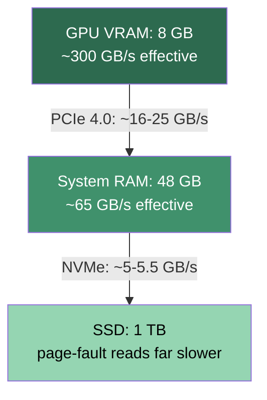

# The Memory Hierarchy: Why Bandwidth Rules Inference

**What you will learn.** This is the central systems document of Phase 1. You will learn why token generation speed in llama.cpp is almost never limited by how fast your CPU or GPU can do math, and almost always limited by how fast bytes can move through the memory hierarchy. We will map every tier of that hierarchy on our actual research machine, derive a simple upper bound formula for decode speed, and compute concrete tokens-per-second ceilings for Qwen3-8B Q4_K_M running on CPU, on GPU, and split between them. By the end you will be able to predict, with one line of arithmetic, whether any model on any hardware will be fast, slow, or unusable.

## The hierarchy on this machine

Every byte of model weights lives somewhere in a pyramid of memories. Each tier is bigger, cheaper, and dramatically slower than the one above it. Here is the pyramid on our i7-14650HX / RTX 5060 Laptop machine, with the arithmetic behind each number.

**GPU VRAM (GDDR7): ~384 GB/s theoretical, ~300 GB/s effective.**
The RTX 5060 Laptop has a 128-bit memory bus running GDDR7 at 24 Gbps per pin:

```
128 bits / 8 = 16 bytes per transfer
16 bytes x 24 GT/s = 384 GB/s theoretical
```

Real sustained bandwidth on large sequential reads (which is exactly what inference does) typically lands at 75 to 85 percent of theoretical, so we will use ~300 GB/s as the effective number.

**System RAM (DDR5-5600 dual channel): 89.6 GB/s theoretical, ~60-70 GB/s effective.**

```
5600 MT/s x 8 bytes per channel x 2 channels = 89.6 GB/s theoretical
```

Real-world efficiency for streaming reads on a client Intel memory controller is usually 65 to 80 percent, so ~60-70 GB/s effective. We will use 65 GB/s in the math below.

One caveat specific to this machine: the 48 GB is a mixed 16 GB + 32 GB pair. Intel Flex Mode interleaves the first 32 GB (16 from each stick) as true dual channel, but the last 16 GB on the larger stick runs single channel at roughly 44.8 GB/s theoretical. Where Windows places the model in physical memory therefore affects real throughput. This is worth measuring in a later experiment.

**PCIe 4.0 link between them: 32 GB/s theoretical (x16), ~16-25 GB/s effective.**
PCIe 4.0 gives roughly 2 GB/s per lane per direction, so x16 is ~32 GB/s and x8 (a common laptop dGPU wiring) is ~16 GB/s. After protocol overhead and real transfer patterns, sustained host-to-device copies land in the 16 to 25 GB/s range on x16, and roughly half that on x8. One wrinkle worth measuring on this machine: the RTX 5060 Laptop is a PCIe 5.0 x8 device, so if the platform actually runs the link at Gen5, the x8 wiring delivers Gen4 x16 numbers (nvidia-smi -q reports the negotiated generation and width). Either way, this link is the bottleneck for any scheme that streams weights to the GPU at generation time.

**NVMe SSD (WD SN5000S, PCIe 4.0): ~5-6 GB/s sequential, far less random.**
Sequential reads sustain about 5 to 6 GB/s. But if data is faulted in through the page cache in 4 KB pages (which is what mmap does when memory runs out), effective throughput can drop by an order of magnitude or more.

```
Tier                    Theoretical      Effective        Capacity
----------------------  ---------------  ---------------  ---------
GPU VRAM (GDDR7)        384 GB/s         ~300 GB/s        8 GB
System RAM (DDR5-5600)  89.6 GB/s        ~65 GB/s         48 GB
PCIe 4.0 link           16-32 GB/s       ~16-25 GB/s      (transit)
NVMe SSD (SN5000S)      ~6 GB/s          ~5-5.5 GB/s      1 TB
```

Notice the shape: each step down is roughly a 4-12x bandwidth cliff. That shape dictates everything that follows.



## Why decode is a bandwidth problem, not a compute problem

Generating one token with a decoder-only transformer means running the token's hidden state through every layer. At batch size 1, every large operation is a matrix-vector multiply: a vector of activations times a huge weight matrix. Each weight is loaded from memory, used for exactly one multiply-add, and discarded. There is no reuse.

The standard way to quantify this is arithmetic intensity: FLOPs performed per byte moved. For Qwen3-8B at Q4_K_M:

```
FLOPs per token   ~= 2 x 8.2B params        = 16.4 GFLOPs
Bytes per token   ~= 5.0 GB of weights read once
Arithmetic intensity = 16.4e9 / 5.0e9       ~= 3.3 FLOPs/byte
```

Now compare that to what each processor needs to stay busy (the roofline balance point):

```
RTX 5060 Laptop:  ~20 TFLOPS / 300 GB/s  ~= 67 FLOPs/byte needed
i7-14650HX:       ~1.5 TFLOPS / 65 GB/s  ~= 23 FLOPs/byte needed
```

Decode delivers 3.3 FLOPs per byte. The GPU wants 67 to be compute-limited. We are memory-bound by a factor of roughly 20 on the GPU and roughly 7 on the CPU. At 60 tokens/sec the GPU performs about 1 TFLOP/s of useful work, around 5 percent of its compute capability. The other 95 percent of the silicon idles, waiting for GDDR7.

Prefill is the opposite case. When llama.cpp processes your 1024-token prompt, it pushes token positions through each weight matrix in batches, 512 at a time with the default ubatch size. Each weight loaded from memory is reused 512 times, arithmetic intensity multiplies by the batch size, far past both balance points above, and the workload becomes compute-bound. This is why prompt processing runs at hundreds or thousands of tokens per second while generation crawls along at tens.

## The decode speed upper bound

The whole analysis compresses into one inequality:

```
tokens/sec  <=  effective bandwidth  /  bytes touched per token
```

Bytes touched per token has two parts:

1. **Weights.** Every parameter is read once per token, with one exception: the input embedding table is a lookup, so only one row of it is read (Qwen3-8B does not tie embeddings, and its separate output head is still read in full to produce logits). For Qwen3-8B Q4_K_M the file is ~5.0 GB (8.2B params at an average of ~4.9 bits each, including the K-quant scale factors); the embedding table is ~0.35 GB of that, so ~4.7 GB is actually read per token. We round to 5.0 GB throughout to keep the arithmetic simple, which makes every ceiling below slightly conservative.
2. **KV cache.** Attention reads every cached key and value for every prior token. Qwen3-8B uses GQA with 8 KV heads of dimension 128 across 36 layers, stored as FP16:

```
KV bytes per cached token = 2 (K and V) x 36 layers x 8 heads x 128 dim x 2 bytes
                          = 147,456 bytes ~= 144 KB
At 4096 context: 4096 x 144 KB ~= 0.60 GB read per new token
```

So early in a generation the model touches ~5.0 GB per token; by token 4096 it touches ~5.6 GB. Decode gets slower as context grows, and the formula predicts by exactly how much.

## The ceiling on CPU, on GPU, and split

Now plug in the numbers for our machine and the 5.0 GB Q4_K_M model.

**CPU only (weights in DDR5):**

```
65 GB/s / 5.0 GB  = 13.0 tokens/sec ceiling (short context)
65 / 5.6          = 11.6 tokens/sec at 4096 context
```

Real llama.cpp throughput typically reaches 60 to 85 percent of this bound, so expect roughly 8 to 11 tokens/sec in practice. We will validate this experimentally in Phase 2.

**GPU only (weights in VRAM, fits in 8 GB with room for KV cache):**

```
300 GB/s / 5.0 GB = 60 tokens/sec ceiling
300 / 5.6         = 53.6 tokens/sec at 4096 context
```

Expect roughly 45 to 55 tokens/sec measured. Note that the 4.6x speedup over CPU is exactly the bandwidth ratio (300/65), not anything to do with CUDA cores.

**Split across both (the case this project actually cares about):**
When llama.cpp offloads some layers to the GPU and leaves the rest on CPU, each token must pass through both parts in sequence. Times add:

```
time per token = bytes_on_gpu / 300  +  bytes_on_cpu / 65
```

With 70 percent of layers on GPU (3.5 GB) and 30 percent on CPU (1.5 GB):

```
t = 3.5/300 + 1.5/65 = 0.0117 + 0.0231 = 0.0347 s   ->  28.8 tokens/sec
```

With 90 percent on GPU (4.5 GB) and 10 percent on CPU (0.5 GB):

```
t = 4.5/300 + 0.5/65 = 0.0150 + 0.0077 = 0.0227 s   ->  44.1 tokens/sec
```

```
Placement                       Ceiling (tokens/sec)
------------------------------  --------------------
100% GPU (5.0 GB in VRAM)       60.0
90% GPU / 10% CPU               44.1
70% GPU / 30% CPU               28.8
100% CPU (DDR5)                 13.0
100% SSD (hypothetical)          1.1
```

Two lessons hide in this table. First, the relationship is harmonic, not linear: the slow tier dominates. Leaving just 30 percent of the model on CPU costs you more than half the GPU-only speed. Second, every gigabyte promoted from RAM to VRAM saves a fixed 1/65 - 1/300 = 12.1 milliseconds per token, which is why the last few offloaded layers matter as much as the first few.

**Why not stream the leftover weights over PCIe instead?** Suppose we kept all compute on the GPU and copied the CPU-resident 1.5 GB across PCIe each token at 20 GB/s: that alone takes 75 ms per token, three times worse than just computing those layers on the CPU (23 ms). Zoom in further: one layer of this model is 5.0/36 ~= 139 MB. The GPU computes a layer in about 0.46 ms, but fetching that layer over PCIe takes about 7 ms. Naive streaming is 15x too slow to hide behind compute. This single ratio is why llama.cpp runs unoffloaded layers on the CPU, and it defines the gap our research has to close.

## When the model spills to SSD, speed collapses

The formula is merciless about the bottom tier. A model read entirely from NVMe at 5.5 GB/s:

```
5.5 GB/s / 5.0 GB = 1.1 tokens/sec
```

That is the optimistic sequential-read bound. Reality is worse. llama.cpp memory-maps the GGUF file, so when weights exceed available RAM the OS page cache silently evicts pages, and every token re-faults them in 4 KB pages with queue depth near 1. Random 4 KB reads on the SN5000S sustain well under 1 GB/s, so real throughput can fall to a token every several seconds.

A concrete bigger-model example: a 70B model at Q4_K_M is ~42 GB. With Windows and the runtime consuming several GB, perhaps 38 GB of RAM is available for weights, so ~4 GB spills every token:

```
t = 38/65 + 4/5.5 = 0.585 + 0.727 = 1.31 s  ->  0.76 tokens/sec (best case)
```

Less than one token per second even under generous assumptions. The cliff between "fits in RAM" and "does not fit in RAM" is the sharpest edge in the entire hierarchy, and the reason the practical model ceiling on this machine is set by RAM size, not disk size.

## The napkin math behind every research question

Every research direction in this project is an attack on one term of `tokens/sec <= bandwidth / bytes`. One line of arithmetic motivates each:

- **Compression (attack the bytes).** Qwen3-8B at FP16 is 16.4 GB; at Q4_K_M it is 5.0 GB. On CPU that is the difference between a 4.0 tokens/sec ceiling and a 13.0 tokens/sec ceiling, a 3.3x speedup from quantization alone before any hardware changes. Every further bit shaved per weight is a direct multiplier on decode speed, bounded only by quality loss.

- **Hybrid execution (attack the placement).** The split formula shows each GB moved from DDR5 to VRAM buys 12.1 ms per token. Optimal layer placement across an 8 GB VRAM budget is a knapsack problem whose payoff we can now compute exactly, including which tensors (attention vs FFN vs KV cache) earn their VRAM residency.

- **Caching (attack "touched").** The bound charges for bytes touched, not bytes stored. If only a fraction of weights is needed per token (MoE experts, activation sparsity as exploited by PowerInfer), effective bytes drop proportionally. A model where each token touches 20 percent of weights behaves like a model one fifth its size: that is how a 30B-class model could hit interactive speeds on this machine.

- **Prefetching (attack the stall).** SSD and PCIe bandwidth are only catastrophic when the pipeline waits on them. If the next token's needed weights are predictable, transfers can overlap compute, as in Apple's LLM-in-a-flash work. Our napkin math says raw streaming is 15x too slow, so prefetching only wins in combination with caching and compression that shrink what must move. Quantifying that combination is precisely the research program.

## Why this matters for our research

Our stated goal is running models larger than 8 GB of VRAM, and eventually larger than 48 GB of RAM, at usable speeds on cheap consumer hardware. This document establishes the ruler we will measure every idea against. The hierarchy on this machine spans 300 GB/s down to 5 GB/s, a 60x spread, and the single inequality `tokens/sec <= effective bandwidth / bytes touched per token` converts any proposed configuration into a predicted speed before we run a single benchmark. It tells us the RTX 5060's compute is nearly irrelevant for decode, that layer placement follows harmonic math where the slow tier dominates, that PCIe streaming is 15x short of viability in naive form, and that an SSD spill is a cliff, not a slope. Every technique we study in later phases, quantization, KV cache compression, speculative decoding, sparsity-aware offloading, prefetching, either reduces bytes touched, moves bytes to a faster tier, or hides transfer latency. When an experiment beats or misses these ceilings, the gap itself is the finding.

## References

- Williams, S., Waterman, A., Patterson, D. "Roofline: An Insightful Visual Performance Model for Multicore Architectures." CACM 2009. https://doi.org/10.1145/1498765.1498785
- Gholami, A. et al. "AI and Memory Wall." arXiv:2403.14123. https://arxiv.org/abs/2403.14123
- Alizadeh, K. et al. "LLM in a flash: Efficient Large Language Model Inference with Limited Memory." arXiv:2312.11514. https://arxiv.org/abs/2312.11514
- Sheng, Y. et al. "FlexGen: High-Throughput Generative Inference of Large Language Models with a Single GPU." arXiv:2303.06865. https://arxiv.org/abs/2303.06865
- Song, Y. et al. "PowerInfer: Fast Large Language Model Serving with a Consumer-grade GPU." arXiv:2312.12456. https://arxiv.org/abs/2312.12456
- Frantar, E. et al. "GPTQ: Accurate Post-Training Quantization for Generative Pre-trained Transformers." arXiv:2210.17323. https://arxiv.org/abs/2210.17323
- Ainslie, J. et al. "GQA: Training Generalized Multi-Query Transformer Models from Multi-Head Checkpoints." arXiv:2305.13245. https://arxiv.org/abs/2305.13245
