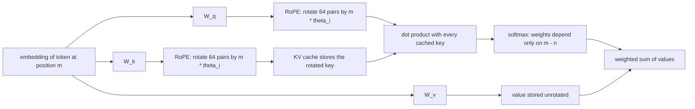
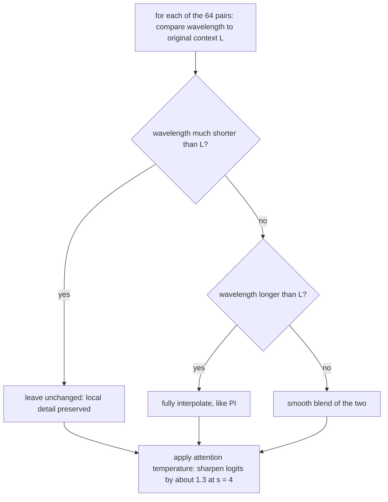

# RoPE, Positional Encoding, and Context Length

**What you will learn.** Attention is a bag-of-tokens operation: without extra machinery it cannot tell "dog bites man" from "man bites dog". This doc explains why transformers need positional information, how the field moved from absolute encodings to Rotary Position Embedding (RoPE), and what the theta base parameter actually controls. You will then see how context windows get stretched beyond their training length with position interpolation, NTK-aware scaling, and YaRN, and what each trick costs. Finally we compute, for our i7-14650HX / RTX 5060 Laptop 8 GB machine running Qwen3-8B Q4_K_M, exactly what long context costs in KV cache memory and attention compute, and why the context length a model advertises is not the context you can actually use.

## Why transformers need positional information

Self-attention computes, for every query token, a weighted sum over value vectors, where the weights come from dot products between the query and every key. Nothing in that formula references position. If you shuffle the input tokens, the set of dot products is identical, just reordered, so the attention output for each token is unchanged. Formally, attention without positional encoding is permutation equivariant.

That is fatal for language. Word order carries meaning, and code is even less forgiving than prose. So every transformer injects position information somewhere, and the design question is where and how.

There are two broad families:

- **Absolute encodings** tag each token with "you are token number 512". The original Transformer paper (Vaswani et al., 2017) added fixed sinusoidal vectors to the input embeddings. GPT-2 used learned position embeddings instead: a lookup table with one trained vector per position. Learned absolute embeddings have a hard wall, position 1025 simply has no vector if you trained with 1024, and sinusoidal ones extrapolate poorly in practice.
- **Relative encodings** tell attention "this key is 7 tokens behind this query" instead of naming absolute positions. Shaw et al. (2018) added learned relative-offset vectors to the keys, T5 used a learned scalar bias per distance bucket added to attention logits, and ALiBi (Press et al., 2021) added a fixed linear penalty proportional to distance. Relative schemes generalize better because "7 tokens apart" means the same thing at position 100 and position 10,000.

The catch: early relative schemes modify the attention score computation itself, which complicates KV caching and fast kernels. RoPE gets relative behavior while keeping attention as plain dot products, which is why virtually every current open model (Llama, Qwen, Mistral, Gemma, DeepSeek) uses it.

## RoPE: rotate the queries and keys

RoPE (Su et al., 2021) encodes position by rotating vectors rather than adding to them. Take one attention head of Qwen3-8B: its queries and keys are 128-dimensional. RoPE views those 128 numbers as 64 two-dimensional pairs. Each pair i is treated as a point in a 2D plane and rotated by an angle proportional to the token position m:

```
angle for pair i at position m  =  m * theta_i
theta_i = base^(-2i / d)        where d = 128, i = 0 .. 63
```

So a token at position 100 gets its query and key pairs rotated by 100 times the per-pair frequency, a token at position 101 by 101 times that frequency, and so on. Values are never rotated, only queries and keys.

The magic is what happens in the dot product. A 2D rotation by angle a followed by the transpose of a rotation by angle b composes into a single rotation by (b - a). So when query at position m meets key at position n:

```
rotate(q, m*theta) . rotate(k, n*theta)  =  q . rotate(k, (n - m)*theta)
```

The absolute positions m and n cancel. Only the offset (n - m) survives. **Relative position falls out of ordinary dot products**, with no extra bias terms, no modified attention formula, and no lookup tables. That is the entire trick.



Practical details that matter for llama.cpp:

- RoPE is applied fresh in **every one of the 36 layers**, to every head, at almost zero cost (a few multiply-adds per pair, invisible next to the matmuls).
- The KV cache stores keys **already rotated**. That is why llama.cpp context-shift tricks have to re-rotate cached keys when they slide the window: a key's stored form bakes in its absolute position.
- RoPE adds **zero parameters and zero per-token memory**. All the cost of long context comes from the KV cache and attention itself, covered below.

## The theta base parameter

The base in `theta_i = base^(-2i/d)` sets the frequency spectrum of the 64 pairs. Pair 0 always spins fastest, completing a full turn every 2*pi (about 6.3) tokens. Each later pair spins slower, and the base controls how much slower the slowest pair is. It is easiest to think in wavelengths: how many tokens of offset before a pair's angle wraps around a full circle.

```
wavelength of pair i = 2*pi * base^(2i/d),  d = 128

pair i   base = 10,000 (Llama 2 era)   base = 1,000,000 (Qwen3)
------   ---------------------------   -------------------------
  0          6.3 tokens                    6.3 tokens
 16         63 tokens                    199 tokens
 32        628 tokens                  6,283 tokens
 48      6,283 tokens                198,700 tokens
 63     54,400 tokens              5,060,000 tokens
```

Read this table as a multi-resolution clock. Fast pairs distinguish "1 token back" from "3 tokens back" (syntax, adjacency). Slow pairs distinguish "500 tokens back" from "5,000 tokens back" (which document, which section). A pair is only useful for distances shorter than about its wavelength; beyond that its angle has wrapped and becomes ambiguous.

Now the problem with base 10,000: the slowest pair wraps at about 54K tokens, and many pairs wrap far earlier. Worse, at positions past the training length the model sees pair angles in combinations it never trained on, and attention scores go out of distribution. This is why Llama 2 (base 10,000, trained to 4K) degenerates quickly past 4K tokens. Qwen3 uses base 1,000,000 and trains natively to 32,768 tokens: the slowest pairs have wavelengths in the millions, so within 32K context every pair is comfortably inside its first rotation and there is plenty of unused low-frequency headroom. That headroom is exactly what the extension methods below exploit.

## Stretching context past the training length

Say you have a model trained to context length L and you want to run it at s times that. Feeding positions beyond L directly (extrapolation) fails: perplexity explodes almost immediately. Three families of fixes exist, all of them supported by llama.cpp.

### Position interpolation (PI)

Chen et al. (2023), and independently the hobbyist kaiokendev, proposed the obvious hack: squash the positions. Replace position m with m/s, so a 131,072-token document occupies the position range 0 to 32,768 the model already knows. In llama.cpp this is `--rope-scaling linear` with `--rope-scale s` (equivalently `--rope-freq-scale 1/s`).

It works, but with two costs. First, it needs fine-tuning (around 1,000 steps in the paper) to reach good quality, because all frequencies get compressed. Second, the compression hurts the fast pairs most: pair 0 used to complete a rotation every 6.3 tokens and now takes 25 tokens at s = 4, so the model's sense of "the immediately previous token" gets blurry. Short-context quality measurably drops.

### NTK-aware scaling

The insight (bloc97, 2023, a Reddit post that changed the field): do not compress all frequencies equally. Instead, raise the base:

```
base' = base * s^(d / (d - 2))

Qwen3-8B, s = 4:  base' = 1,000,000 * 4^(128/126)  =  about 4,090,000
classic base 10k, s = 4:  10,000 * 4^(128/126)     =  about 40,900
```

Raising the base leaves the fastest pair untouched (its exponent is zero) and slows the slowest pairs by roughly the factor s. High-frequency local information survives intact, low-frequency pairs get interpolated, and the middle blends smoothly. The remarkable result: this works passably with **no fine-tuning at all**. The "dynamic NTK" variant recomputes the effective base on the fly as the sequence grows, so short prompts are not penalized. In llama.cpp you can set the base directly with `--rope-freq-base`.

### YaRN

YaRN (Peng et al., 2023) is the refined version most current models ship with, including Qwen3. Two ideas:

1. **NTK-by-parts.** Classify each pair by its wavelength relative to the original context L. Pairs with wavelength much shorter than L complete many full rotations inside the training window, so the model has already seen every angle they can produce; leave them completely alone (extrapolate). Pairs with wavelength longer than L carry the "where in the whole document" signal, so fully interpolate them like PI. Pairs in between get a smooth blend.
2. **Attention temperature.** Longer contexts spread softmax attention over more keys, raising its entropy. YaRN counteracts this by sharpening the logits: divide by a temperature t where `sqrt(1/t) = 0.1 * ln(s) + 1`. For s = 4 that is a factor of about 1.14 on q and k each, so logits scale by roughly 1.30. It is implemented by scaling the query and key, so it costs nothing at runtime.



Qwen3-8B advertises 131,072 context precisely as native 32,768 times a YaRN factor of 4. On our machine the invocation is:

```
llama-server -m qwen3-8b-q4_k_m.gguf -c 131072 --rope-scaling yarn --rope-scale 4 --yarn-orig-ctx 32768
```

One warning from Qwen's own model card: static YaRN applies the scaling even to short prompts and slightly degrades them, so only turn it on when you actually need more than 32K.

## The real costs of long context

RoPE tricks make long context *possible*. They do nothing about what it *costs*. Two resources grow with context: KV cache memory (linearly) and attention compute (quadratically over a full prefill). Doc 03 in this series derives the KV cache in detail; here is the summary for Qwen3-8B, which uses GQA with 8 KV heads of dimension 128 across 36 layers:

```
per-token KV = 2 (K and V) * 36 layers * 8 heads * 128 dims * 2 bytes (F16)
             = 147,456 bytes = 144 KiB per token

context      KV cache F16     KV cache Q8_0 (approx)
--------     ------------     ----------------------
  4,096         576 MiB              306 MiB
  8,192        1.13 GiB              0.60 GiB
 16,384        2.25 GiB              1.20 GiB
 32,768        4.50 GiB              2.39 GiB
 65,536        9.00 GiB              4.78 GiB
131,072       18.00 GiB              9.56 GiB
```

Set that against our hardware. The Q4_K_M weights are about 5.03 GB and the RTX 5060 Laptop has 8 GB of VRAM. Weights plus full 32K F16 KV cache is about 9.9 GB: it does not fit. At the advertised 131K, the KV cache alone is 18 GiB, more than double the entire VRAM, and even Q8_0 KV quantization leaves it larger than the card. Long context on this class of hardware is a memory problem before it is anything else.

It is also a bandwidth problem. Decode is memory-bound: every generated token must stream the weights plus the entire KV cache through the compute units. Ceiling estimates for CPU-only decode at our theoretical peak of 89.6 GB/s:

```
context    bytes read per token         CPU ceiling (89.6 GB/s)
-------    ----------------------       -----------------------
     0     5.03 GB (weights only)            17.8 tok/s
 8,192     5.03 + 1.21 = 6.24 GB             14.4 tok/s
32,768     5.03 + 4.83 = 9.86 GB              9.1 tok/s
131,072    5.03 + 19.3 = 24.4 GB              3.7 tok/s
```

These are upper bounds (real throughput lands below them), but the shape is what matters: at 32K context you have roughly halved your decode speed, and at 131K you have cut it by nearly five times, without changing the model at all.

Attention compute grows too. Per generated token at position N, the score and value-weighting work is about `2 sides * 32 Q heads * 128 dims * 2 FLOPs * N` per layer, which is `589,824 * N` FLOPs across 36 layers. The weight matmuls cost a fixed `2 * 8.2e9 = 16.4 GFLOPs` per token. Setting them equal: at **N of roughly 27,800 tokens, attention math costs as much per token as the entire rest of the model**. For a full 32K prefill the causal attention total is about `589,824 * N^2 / 2 = 317 TFLOPs`, on top of 537 TFLOPs of weight matmuls, so attention adds about 60 percent to prefill compute at 32K and overtakes the weight matmuls entirely once the prefill passes roughly 56,000 tokens. This is why llama.cpp's FlashAttention flag (`-fa`) matters at long context: it does not reduce the FLOPs, but it avoids materializing the huge score matrices and keeps the KV traffic efficient.

## Advertised context vs usable context

A model card that says "131,072 context" is making a claim about positional encoding validity, not about competence. Three gaps to be aware of:

- **Training length distribution.** Most pretraining documents are short. A model "trained to 32K" saw relatively few sequences that actually filled 32K, and a YaRN-extended 131K mode may have seen little or no genuine 131K training at all. The mechanism works; the skill is thinner than the number implies.
- **Lost in the middle.** Liu et al. (2023) showed models retrieve information best from the start and end of the context, with a pronounced sag in the middle. Stuffing a critical fact at token 60,000 of a 120,000-token prompt is the worst place for it.
- **Benchmarks disagree with model cards.** Simple needle-in-a-haystack retrieval is nearly solved, but RULER (Hsieh et al., 2024), which tests multi-hop tracing and aggregation over long inputs, routinely finds the *effective* context of open models to be half or less of the advertised figure.

The practical reading for an 8B-class model: treat native 32K as the trustworthy zone, treat YaRN 131K as an emergency capability for retrieval-flavored tasks, and keep the instructions and the key facts near the ends of the prompt. And as computed above, on our hardware the throughput and memory penalties bite long before the model's quality ceiling does.

## Why this matters for our research

Our goal is running models larger than 8 GB VRAM well on cheap hardware, and context length is the second axis of that fight. The KV cache is effectively a second model that grows with every token: at 32K context, Qwen3-8B's cache (4.5 GiB F16) is nearly as large as its weights (5 GB), and every decoded token must stream both. Every layer-offloading and cache-placement decision we make in later experiments has to budget for this, and the 27,800-token crossover tells us when attention compute stops being a rounding error.

RoPE specifics also constrain our tooling. Because cached keys are stored pre-rotated, context shifting and prompt caching in llama.cpp interact with RoPE in ways we need to measure, and YaRN flags (`--rope-scaling yarn --rope-scale 4 --yarn-orig-ctx 32768`) let us trade short-context quality for reach without retraining anything. Most importantly, the numbers here define our experiment matrix: KV quantization (F16 vs Q8_0 vs Q4), context size vs decode speed on the 89.6 GB/s memory bus, and whether the advertised 131K is ever worth its 18 GiB price on a 48 GB machine. Cheap long context, not just cheap parameters, is what makes a local model actually useful for real work.

## References

- Vaswani et al., "Attention Is All You Need", 2017. https://arxiv.org/abs/1706.03762
- Shaw et al., "Self-Attention with Relative Position Representations", 2018. https://arxiv.org/abs/1803.02155
- Raffel et al., "Exploring the Limits of Transfer Learning with a Unified Text-to-Text Transformer" (T5, relative bias), 2019. https://arxiv.org/abs/1910.10683
- Press et al., "Train Short, Test Long: Attention with Linear Biases Enables Input Length Extrapolation" (ALiBi), 2021. https://arxiv.org/abs/2108.12409
- Su et al., "RoFormer: Enhanced Transformer with Rotary Position Embedding" (RoPE), 2021. https://arxiv.org/abs/2104.09864
- Chen et al., "Extending Context Window of Large Language Models via Positional Interpolation", 2023. https://arxiv.org/abs/2306.15595
- bloc97, "NTK-Aware Scaled RoPE", 2023. Reddit post, r/LocalLLaMA (no arXiv; formalized in the YaRN paper).
- Peng et al., "YaRN: Efficient Context Window Extension of Large Language Models", 2023. https://arxiv.org/abs/2309.00071
- Dao et al., "FlashAttention: Fast and Memory-Efficient Exact Attention with IO-Awareness", 2022. https://arxiv.org/abs/2205.14135
- Liu et al., "Lost in the Middle: How Language Models Use Long Contexts", 2023. https://arxiv.org/abs/2307.03172
- Hsieh et al., "RULER: What's the Real Context Size of Your Long-Context Language Models?", 2024. https://arxiv.org/abs/2404.06654
